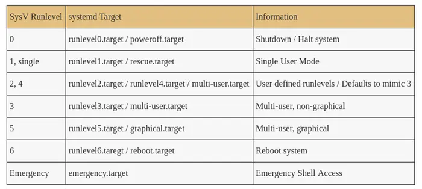

# Ch 01. 부팅 및 시스템 관리 데몬의 이해

## 부팅 프로세스 이해

물리 호스트 사용 시 물리 머신의 전원 버튼을 누르게 되면 전원이 인가돼서 BIOS가 구동됨 (하드웨어 체크)  
리눅스 로딩 및 부팅 → 로그인

가상 머신(중지됨) → 인스턴스 시작 → 상태 검사 진행 → SSH를 통한 인스턴스 접근(= 네트워크를 통한 서버 접속) 
부팅 관련 로그는 부팅 후 dmesg, syslog 확인

네트워크 설정 오류로 부팅 후 SSH 접속이 되지 않으면 dmesg를 확인할 수 없음 
→ 시스템 로그 확인용 콘솔 메뉴를 확인한다.

리눅스 시스템 부팅 순서 

1. BIOS에서 하드웨어 검사 후 부팅 기기 선택 및 파티션 식별
2. 부트로더에서 커널 선택 및 커널 로드
3. 커널 자료구조 초기화 및 시작 서비스 구동

**BIOS**
- 컴퓨터에 전원이 인가되면 실행이 시작되는 최초의 프로그램
- 마더보드에 연결된 디바이스를 초기화하고 검사(POST, Power On Self Test)하는 역할
- 부트로더 또는 운영체제를 RAM으로 읽어오는 기능을 수행

BIOS가 부트로더 로딩 → 부트로더가 운영체제 리눅스 운영체제 로딩 
클라우드 환경에서는 BIOS까지 확인하는 경우는 드무나, 호스트 머신의 하드웨어 문제가 발생했다면 instance를 stop하고 start해서 VM이 문제가 있는 호스트가 아닌 다른 호스트에서 구동시켜 문제를 해결한다. 
restart는 동일한 호스트에서 재구동된다는 점에서 stop + start와 다르다. 

dmidecode
- `dmidecode` 커맨드를 통해 dmide 테이블에 저장되어 있는 정보를 사람이 읽을 수 있는 형태로 출력 가능
- DMI 테이블은 하드웨어 구성 요소에 대한 여러 정보를 추적하기 위한 산업 표준, 시스템 하드워드 정보, 시리얼 번호, BIOS 리비전 등의 정보가 유지됨 (로우 레벨의 하드웨어 정보)
- `dmidecode -t memory` 커맨드를 입력하면 물리 호스트에서는 manufacturer 정보나 type, size 등 하드웨어 관련 정보가 출력되고, AWS EC2에서는 모든 것이 가상화되어 있기 때문에 대부분의 경우 not specified 혹은 None으로 출력된다.

BIOS vs UEFI
- BIOS: 전통적인 PC 펌웨어
- UEFI: BIOS를 계승해서 좀 더 정형화하고 표준화한 PC 펌웨어, 2TB 이상 스토리지 볼륨 지원, 빠른 부팅시간, UI 및 기능 개선(주소 공간 추가)
- PC 환경에서는 UEFI가 표준화되어 가고 있지만, 가상화 환경에서는 BIOS가 여전히 많이 사용됨
    - Intel 및 AMD 인스턴스 유형은 레거시 BIOS에서 실행됨
    - Graviton 인스턴스는 UEFI에서 실행됨

Boot Loader

- 사용 가능한 커널을 확인하고 로드하는 작업 진행
- 대부분의 부트 로더는 부팅 타임에 사용 가능한 운영체제를 선택하기 위한 UI를 제공함
- 동일한 커널 버전이더라도 다른 옵션을 이용해 다른 모드로 커널을 부팅할 수 있는 기능을 제공함
- 대부분의 리눅스 배포판에서 **GRUB 2**을 기본 부트로더로 사용함
    - 커널 목록, 부팅 옵션(디버그 옵션, 셸 지정, 루트 볼륨 지정 등) 선택
    - 일반 텍스트 파일로 설정을 관리하고 있음(/boot/grub2/grub.cfg)
    - 리눅스 구동 전에도 대부분의 파일시스템을 인식하므로 해당 cfg 파일을 읽어서 맞게 처리할 수 있음

EC2에서 커널 업데이트를 수행했는데, 커널이 손상되어 부팅에 실패함. 부팅에 실패했으므로 SSH를 이용한 접근도 불가함
- GRUB 설정을 변경하여 이전 버전의 커널로 돌아가도록 기본 커널의 정보를 변경해야 함
- 커널 정보를 변경하기 위해서는 GRUB이 있는 루트 볼륨에 접근해야 함
    - 방법 1. EC2 직렬 콘솔 기능을 사용, Nitro 기반 인스턴스 유형만 사용 가능
    - 방법 2. 복구 인스턴스 사용, 별도의 가상 머신을 생성해 인스턴스의 볼륨을 마운트해 GRUB 설정의 기본 커널 정보를 변경 → 원래 인스턴스에 다시 마운트 후 부팅하면 이전 버전 커널을 가지고 VM 구동 가능
    - 참고 자료: https://repost.aws/ko/knowledge-center/revert-stable-kernel-ec2-reboot

 
 

## 시작 서비스의 이해

시작 서비스
- 시스템 구동 시 최초로 실행되는 사용자 레벨 프로세스, 시스템 구동에 필요한 스크립트 실행(PID 1)
    - 컴퓨터 이름 설정
    - 타임존 설정
    - fsck로 디스크 상태 확인
    - 파일 시스템 마운트
    - /tmp 디렉토리의 오래된 파일 삭제
    - 네트워크 인터페이스 구성
    - 패킷 필터 설정
    - 네트워크 서비스 시작
    - 기타 데몬 시작
- 시작 서비스 위치: /etc/init.d/
- rc 디렉토리(0-6 및 s, 각 글자는 실행 레벨 의미)의 실행 레벨에 맞게 시작 서비스가 구동됨
- 최근에는 **systemd**라는 시작 서비스를 사용함
    - 기존 init 프로세스보다 더 넓은 범위의 기능을 제공함
    - Red Hat, Debian, Ubuntu에서 기본 init 프로세스로 선택됨

실행 레벨 = operating mode  

- 운영체제가 부팅 이후에 머신 상태를 결정하는데 쓰는 모드
- 실행 레벨에 따라 어떤 프로그램을 실행할 것인지 결정함
    - single user(1): 파일시스템 마운트, 네트워크 비활성화, 시스템 관리용 쉘 접근
    - multi user: 일반적인 사용자 접근

## systemd 소개

Systemd 주요 역할
- 기존init 프로세스의 기능을 지원 및 통합
- 동작모드에 따른 시작 서비스 관리(기존run level)
- 병렬 실행 및 종속성 모델 관리
- 커널 로그 엔트리 관리(journald)
- 네트워크 연결 관리(networkd)
- 로그인 관리(logind)

systemd는 unit 단위로 작업을 관리함  
unit의 유형으로는 service, socket, device, mount, automount, swap, target, path, timer, slice, scope 등이 있으며 이러한 유형은 unit 파일의 suffix로 활용됨(예: ssh.service) 
unit 별로 수행할 작업의 정의나 설정은 unit에 정의함 

Unit 파일 형식(ini 파일 형식)
- unit 섹션: unit의 기본 정복 정의
    - description: 사람이 읽을 수 잇는 unit 정보, 레이블로도 활용됨
    - after, requires, wants: unit의 종속성 지정
- unit 유형 섹션: unit 유형에 따른 속성 정의
    - execstart: 절대 경로를 이용하여 구동할 명령어 지정
    - restart: 서비스 재시작 여부 지정
- install 섹션: unit 설치와 관련된 정보 정의
    - alias: unit을 등록할 때 사용하는 이름(systemctl enable sshd.service - sshd.service는 시스템 시작 시 자동으로 실행됨)
    - wantedby: unit 간 종속성 지정(multi-user.target : 해당 실행 모드 구동 시 자동 실행)

systemd를 관리하기 위해 systemctl을 사용함
- systemd의 상태를 조사하고 설정을 변경하는 데 사용되는 도구
- 자주 사용되는 systemctl 서브커맨드
    - list-unit-files [pattern] :  설치된 Unit 목록 확인
    - enable unit: unit이 부팅 시자동활성화
    - disable unit: unit이 부팅 시 자동 활성화 되는 것을 방지
    - isolate target: 타겟의 실행 모드를 변경
    - start unit: unit을 즉시 활성화
    - stop unit: unit을 즉시 비활성화
    - restart unit: unit을 재시작, 실행되지 않은 상태였다면 start
    - status unit: unit의 상태 및 최근 로그 내용을 확인
    - kill pattern: 패턴과 일치하는 unit에 시그널을 보냄
    - reboot: 컴퓨터를 재시작
    - daemon-reload: unit 파일들과 systemd 설정 정보를 다시 로드

unit 간 의존성
- Unit 파일의 [Unit] 영역에 명시적 종속성 설정 가능
- 패키지 매니저를 통해 설치한 경우,관련된 설정이 포함됨
    - Wants: 가능하다면 함께 실행이 필요한 unit, 반드시 요구되는 종속성은 아님
    - Requires: 엄격한 의존성을 가짐, 종속성을 가진 unit이 실패하는 경우 서비스가 종료됨
- Unit 간의 실행 순서는 Before, After 제약을 지정하여 조정되며, wants나 requires보다는 after 속성이 자주 사용되는 편
- 명시적으로 요청되지 않은 경우 직렬적인 종속성은 없음 → 병렬적 수행 용이

## 시스템 재부팅 및 종료

- 재부팅을 통해 해결하는 것은 서비스 중단을 의미하기 때문에 권장하지 않고, 근본적인 원인을 찾아야 함
    - 메모리 풀이나 네트워크 소켓 수 증가 등을 단순히 재부팅으로 해결하면 동일한 문제가 발생할 수 있음
    - 시작 스크립트를 수정하는 등 중요한 설정을 변경한 후에는 반드시 즉시 재부팅을 해서 해당 설정이 제대로 적용이 됐는지 검증해야 함
- 물리 호스트 종료: `suod halt -p`, `sudo shutdown -h now`, `sudo reboot`
- 클라우드 가상 머신 종료: 위와 동일한 명령어 사용
    - 웹 콘솔이나 API를 사용해 종료하는 것은 권장하지 않음, 실행 중인 프로세스가 제대로 종료되는 시간을 확보하지 못하는 경우가 많기 때문
    - 인스턴스 종료 시 복구가 불가능하므로 종료 방지 기능 사용을 추천함

부팅 실패한 시스템 복구 방법
- 디버깅을 하지 않고 백업(스냅샷)으로 복구함
    - 클라우드에서 많이 사용됨
- 디버깅 모드로 시스템을 구동하여 복구함
    - 네트워크가 사용 불가능하므로 콘솔에 물리적인 접근이 필요함, 클라우드에서는 사용 어려움
- 복구 머신을 이용하여 복구함
    - 다른 시스템 이미지로 부팅한 후 문제가 있는 시스템의 파일 시스템을 마운트하여 복구함
    - EC2 직렬 콘솔 접근 방법을 사용할 수도 있음