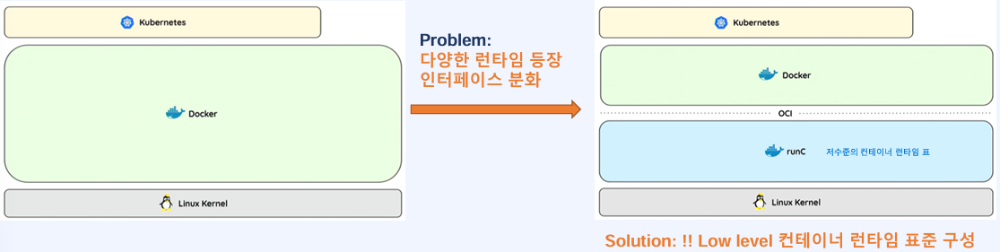
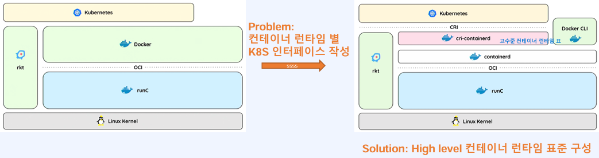
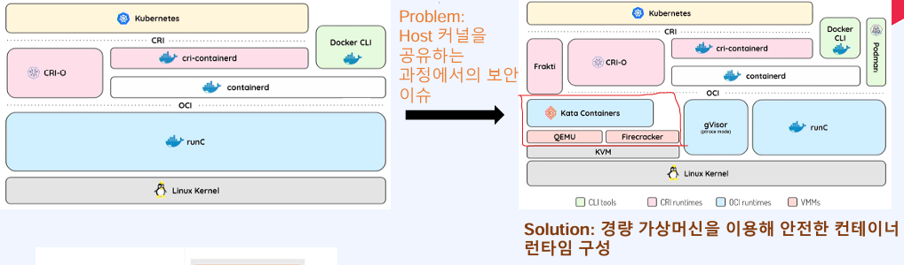

# 온프레미스와 클라우드에서의 리눅스

| 구분         | 온프레미스            |클라우드         |
| ---------- | ------------------- | --------------------- |
| **인프라**    | - 직접 구매·설치·관리 - 서버 준비에 수주~수개월 소요 - 초기 투자 비용 중심     | - 필요한 만큼 즉시 할당 - 사용한 만큼 비용 지불 - API/SDK 기반 자동화 (예: Terraform) |
| **컴퓨팅 환경** | - 하드웨어 가상화 기반(VM) - VM 단위 확장(스케일업/아웃) - OS 부팅 후 앱 실행 → 느림 | - OS 레벨 가상화 기반(Container) - 컨테이너 단위 확장 - 즉각적 실행(앱만 실행) - Linux 자원 격리(cgroups, namespaces) |
| **서버 관리**  | - 커스텀 쉘 스크립트로 운영 - 담당자 의존도 높음 - 스크립트 오류 가능                | - 자동화 도구 활용(Ansible 등) - 필요한 부분만 스크립트 사용 - 선언적 방식으로 관리 효율↑                                   |
| **장애 대응**  | - 서버 직접 접속해 리눅스 명령 기반 분석 - 운영자 역량에 따라 대응 편차 큼                | - 중앙집중 로깅/모니터링 환경 - 수집된 데이터 기반으로 장애 판단 - 자동화된 대응 프로세스 가능                                     |

# 컨테이너

__컨테이너__ : 애플리케이션의 코드 + 종속성 + 실행환경을 하나의 패키지로 묶어 구성한 형태
컨테이너 런타임(Docker, containerd 등)이 있는 곳이라면 어떤 환경에서도 동일하게 실행된다.
로컬에서 아티팩트를 만들면, 동일한 패키지를 기반으로 개발·테스트·배포를 일관성 있게 수행 가능하다.

컨테이너의 장점
1. 민첩성
    - 개발자가 애플리케이션을 빠르게 빌드하고 배포 가능
    - 이미지 기반 배포로 속도와 반복성이 높음
2. 이식성
    - OS 종류, 플랫폼, 클라우드 환경에 관계없이 동일하게 실행
    - 개발 환경 → 테스트 → 프로덕션까지 일관된 패키지(이미지) 사용
3. 신속한 확장성
    - 애플리케이션 단위 컨테이너를 필요 수 만큼 빠르게 스케일링
    - 동일 인프라 위에서 더 많은 컨테이너 구동 가능
    - 오토스케일링과 결합해 트래픽 변화에 즉각 대응 가능

# VM vs 컨테이너

| 구분         | VM(Virtual Machine)         | 컨테이너(Container)         |
| ---------- | ---------------------------- | --------------------------- |
| **가상화 방식** | 저수준 하드웨어(CPU, Disk, Network)를 가상화          | 애플리케이션 구동에 필요한 종속성을 패키지화하여 OS 위에서 가상화                   |
| **장점**     | - 동일 서버에서 다양한 운영체제 병행 실행 가능 - 물리 머신 대비 자원을 효율적으로 사용            | - 어떤 환경에나 배포 가능(이식성 높음) - OS 부팅·라이브러리 로드 불필요 → 매우 빠름 - 경량 구조로 자원 효율성 높음 - 시작 시간이 수초 이내 - 하나의 호스트에 더 많은 애플리케이션 실행 가능 - OS 패치 등 유지관리 오버헤드 감소 |
| **단점**     | - OS 이미지·라이브러리·애플리케이션이 VM마다 반복 포함 → 무거움 - 규모 증가 시 자원 중복 사용량 증가 | - 정의된 OS에 종속적 - 커널을 공유하므로 멀티 테넌트 환경에서 보안 리스크 존재         |

# Docker 다중 운영체제 지원

Docker는 컨테이너가 호스트 OS의 커널을 공유하는 **OS 레벨 가상화** 기술을 사용한다. 따라서 다양한 운영체제를 사용할 수 있다.

이를 이해하기 위해서는 리눅스 커널과 리눅스 배포판의 차이를 알아야 한다.

  
- 리눅스 커널: 하드웨어 자원을 관리하고 추상화하여 프로세스에 할당하는 핵심 역할
- 리눅스 배포판: 리눅스 커널에 윈도우 시스템, 데스크톱 환경, 서비스 데몬, 패키지 매니저, 애플리케이션 등 여러 컴포넌트를 추가하여 패키징한 것 (예: Ubuntu, CentOS)
    - 윈도우 시스템: 운영체제를 리눅스 커널 위에서 GUI 환경을 제공
    - 데스크톱 환경: 데스크탑으로 활용하기 위한 소프트웨어 컴포넌트
    - 서비스 데몬: 네트워크와 시스템 서비스를 관리
    - 패키지 매니저: 리눅스 패키지 설치
    - 애플리케이션: 인터넷 브라우저 등

Ubuntu 호스트에서 Amazon Linux 컨테이너를 실행하는 사례도 동일하다. 
Amazon Linux 컨테이너는 Ubuntu 호스트(Host OS)의 리눅스 커널을 공유한다. 
컨테이너 이미지는 scratch(비어있는 초기 레이어) 위에 Amazon Linux 배포판의 루트 파일 시스템(FHS)을 ADD 하여 생성된다. 
즉, 컨테이너는 커널을 공유하되, 배포판 고유의 파일 시스템과 컴포넌트들(예: /bin/bash 등)을 격리된 환경에서 실행한다. 

Ubuntu(Linux) 호스트에서 Windows 컨테이너는 동작하지 못한다. Linux 커널과 Windows 커널은 다르기 때문이다. 
하지만 Windows 또는 macOS 호스트에서 Ubuntu(Linux) 컨테이너는 LinuxKit이라는 추가적인 가상화 레이어를 사용하여 실행될 수 있다. Windows의 Hyper-V 나 macOS의 HyperKit같은 하이퍼바이저를 이용해 경량의 Linux VM을 실행하고, 모든 Linux 컨테이너는 이 VM의 커널을 공유하는 방식으로 동작한다. 

# 컨테이너 관련 표준

## OCI (Open Container Initiative)

문제점: Docker 외에 다양한 컨테이너 런타임이 등장하면서 쿠버네티스 같은 오케스트레이션 도구가 각 런타임에 맞춰 별도의 인터페이스를 구현해야 했다. 
해결책: 컨테이너 형식과 런타임에 대한 업계 표준으로 OCI가 등장했다. 
**OCI 런타임**은 Cgroups, namespace 설정 등 컨테이너를 실제로 실행하는 데 필요한 저수준 런타임이고, **runc**는 OCI 스펙에 따라 컨테이너를 생성하고 실행하는 CLI 도구이다. 

## CRI (Container Runtime Interface)

문제점: OCI가 저수준 런타임을 표준화했지만, 쿠버네티스는 여전히 rkt, docker 등 다양한 고수준 런타임 각각에 대한 인터페이스가 필요했다. 
해결책: 쿠버네티스가 다양한 컨테이너 런타임을 사용할 수 있도록 하는 플러그인 인터페이스 표준인 **CRI**가 등장했다. 
CRI는 컨테이너의 라이프사이클(생성, 시작, 중지)과 이미지 관리를 담당하는 고수준 런타임이고, containerd, CRI-O, Docker Engine 등이 있다. 
쿠버네티스(Kubelet)는 CRI 표준을 통해 containerd 같은 고수준 런타임과 통신하고, containerd는 OCI 표준을 통해 runc 같은 저수준 런타임과 통신하여 실제 컨테이너를 실행한다. 

## 컨테이너 보안 문제

문제점: 기존 컨테이너 모델은 호스트의 커널을 공유한다. 따라서 컨테이너 하나가 해킹당해 권한을 탈취당하면 호스트 커널을 통해 다른 컨테이너나 호스트 전체에 접근할 수 있는 보안 이슈가 발생할 수 있다. 
해결책: **경량 가상머신**을 사용하여 컨테이너를 VM처럼 격리한다. 

- Firecracker: AWS가 개발한 경량 VM으로 QEMU를 경량화하여 보안, 고성능, 낮은 오버헤드가 특징인 오픈소스
- Kata Containers: 쿠버네티스에서 Firecracker나 QEMU 같은 다양한 경량 VM 런타임을 플러그인 인터페이스