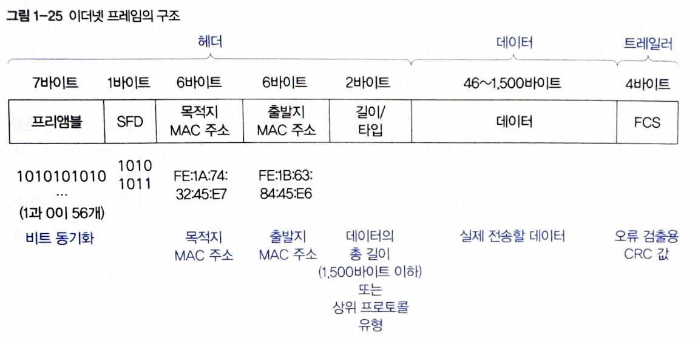

# 1.1 네트워크 계층 모델

## 1.1.1 OSI 7계층 모델

 

**OSI 7계층**은 물리 → 데이터 링크 → 네트워크 → 전송 → 세션 → 표현 → 응용의 7단계로 구성된다.  
데이터는 출발지 응용 계층에서 생성되어 하위 계층으로 전송되고, 물리 계층을 통해 목적지에 도달한 후 상위 계층으로 역전송되어 응용 계층에서 최종 수신된다.

 
 

## 1.1.2 TCP/IP 모델

TCP/IP 모델은 응용 계층, 전송 계층, 인터넷 계층, 네트워크 인터페이스 계층의 4계층으로 구성되어 있다. 

OSI의 상위 3계층(세션·표현·응용)은 TCP/IP의 응용 계층으로 통합되고, 전송 계층은 유지되며, 네트워크 계층은 인터넷 계층, 하위 2계층은 네트워크 인터페이스 계층으로 통합된다. 

데이터는 응용 → 전송 → 인터넷 → 네트워크 인터페이스 계층을 거치며 데이터 → 세그먼트 → 패킷 → 프레임 순으로 캡슐화, 수신 측에서는 반대 순서로 역캡슐화된다. 

 
 

# 1.2 LAN의 개요

__LAN(Local Area Network)__ 은 가까운 지역을 연결하는 근거리 통신망으로, 유선 LAN과 무선 LAN의 두 종류로 나뉜다.
- 유선 LAN: 케이블로 연결해 안정적이지만 이동성 제한
- 무선 LAN: 전자기파로 연결해 이동성 높지만 속도·보안 취약, 와이파이

 

컴퓨터 간 통신은 전압 차이로 표현된 0과 1의 전기 신호를 케이블로 주고받는 방식이다.
여러 컴퓨터를 연결하기 위해 __허브(Hub)__ 가 사용되며, 이는 여러 포트를 가진 리피터로서 여러 컴퓨터의 신호를 증폭·전달한다.  
과거에는 널리 쓰였지만, 현재는 스위치의 등장으로 거의 사용되지 않는다.

 

허브에는 두 가지 주요 문제가 있다.
1. 데이터 브로드캐스팅 문제: 허브는 받은 데이터를 모든 컴퓨터로 전송해 불필요한 트래픽과 보안 취약성을 초래한다.
2. 데이터 충돌 문제: 여러 컴퓨터가 동시에 데이터를 보내면 충돌이 발생해 속도 저하나 네트워크 마비가 일어날 수 있다.

 

콜리전 도메인은 네트워크에서 데이터 충돌이 발생할 수 있는 영역을 의미한다.  
허브는 모든 컴퓨터가 하나의 콜리전 도메인을 공유하여 충돌이 자주 발생한다. 하지만 스위치는 각 포트를 별도의 콜리전 도메인으로 분리해 충돌을 줄이고 성능을 높인다.
허브는 이러한 충돌 문제를 완화하기 위해 CSMA/CD 방식을 사용한다.

 

 

CSMA/CD(Carrier Sense Multiple Access with Collision Detection)는 허브 기반 네트워크에서 데이터 충돌을 감지하고 재전송하는 기술이다.
동작 단계는 다음과 같다.
1. 반송파 감지: 다른 컴퓨터가 전송 중인지 더미 데이터를 전송해 확인
2. 다중 접속: 네트워크가 비어 있으면 데이터 전송
3. 충돌 탐지: 충돌 발생 시 전송 중단 후 임의 시간 대기 → 재전송

무선 LAN은 신호 감쇠나 장애물로 인해 충돌 탐지가 어려워, CSMA/CD 대신 CSMA/CA(충돌 회피 방식)를 사용한다. 동작 단계는 다음과 같다.
1. 반송파 감지: 네트워크 사용 여부 확인
2. 랜덤 백오프: 충돌 방지를 위해 임의 시간 대기 후 전송
3. ACK 확인: 수신 확인 신호(ACK)로 전송 성공 여부 판단

초기에는 여러 장치가 하나의 케이블을 공유해 이 기술이 필수였지만, 스위치의 콜리전 도메인 분리로 충돌이 사라지며 중요성이 줄어들었다.

 

브로드캐스트 도메인: 한 네트워크에서 브로드캐스트 메시지가 도달하는 범위(같은 허브에 연결된 장치들) 
라우터는 서로 다른 네트워크(브로드캐스트 도메인)를 분리하며, 라우터는 브로드캐스트를 전달하지 않아 트래픽·보안 문제를 방지한다. 라우터가 브로드캐스트를 다른 네트워크로 연결하면 한 네트워크에서 보낸 방송이 모든 연결된 네트워크로 퍼져 결과적으로 모든 네트워크의 모든 장치가 동시에 데이터를 받아 처리해야 한다.

허브는 들어온 데이터를 단순 복사해 연결된 모든 장치에 전송하므로 모든 장치가 동일한 데이터를 받게 되어 보안·효율 문제가 발생한다.  
이를 해결하기 위해 네트워크에 연결된 모든 장치에 MAC 주소라는 고유한 식별자를 부여한다. 
프레임에 출발지·목적지 MAC 주소를 포함하면 각 장치는 자신에게 온 프레임만 받아들이고 나머지는 버리므로, 허브 환경에서도 불필요한 수신을 논리적으로 차단할 수 있다.

 

  

MAC 주소는 네트워크 인터페이스 카드(NIC) 에 부여된 고유한 물리적 주소로, 장치가 네트워크 매체에 접근해 데이터를 주고받는 방식을 제어한다. 
한 장치가 유선 LAN, 무선 LAN, 블루투스 등을 사용한다면 인터페이스별로 각각 다른 MAC 주소가 존재한다. 
MAC 주소는 6쌍의 16진수(총 6바이트) 로 구성되며, 앞의 3쌍은 제조사 식별자(IEEE 할당), 뒤의 3쌍은 장비 고유 번호를 나타낸다.

 
 

# 1.3 프레임

LAN에서는 데이터를 프레임 단위로 주고받으며, 이는 목적지/출발지 MAC 주소와 데이터 및 제어 정보를 포함하는 전송 단위이다. 대부분의 유선 LAN은 IEEE 802.3 이더넷 프레임을 사용하며, 이는 네트워크 인터페이스 계층에서 동작해 MAC 주소 기반으로 데이터를 전송한다. 
 

  

이더넷 프레임은 헤더(제어 정보), 데이터(실제 전송 내용), 트레일러(오류 검출 정보)로 구성된다. 주요 구성 요소는 다음과 같다.
- 프리앰블(7B): 비트 동기화를 위한 시작 신호 (1과 0이 반복)
- SFD(1B): 프레임 시작 표시 비트열 10101011
- 목적지 MAC 주소(6B): 수신 장치 주소, 브로드캐스트는 FF:FF:FF:FF:FF:FF
- 출발지 MAC 주소(6B): 송신 장치 주소
- 길이/타입(2B): 값이 0~1500이면 데이터 길이, 1536 이상이면 상위 프로토콜 타입
- 데이터(46~1500B): 전송 내용(부족 시 패딩으로 채움)
- FCS(4B): CRC 기반 오류 검출 코드, 전송 중 손상 여부 확인용

이더넷 프레임의 길이/타입 필드에서 1501-1535(0x05DD~0x05FF) 구간은 공식적으로 정의되지 않은 예약 영역이다. 이는 Ethernet II(타입 필드 사용)와 IEEE 802.3(길이 필드 사용) 간의 호환성 문제를 방지하기 위해 __1536(0x0600)__ 을 경계값으로 설정했기 때문이다.  
따라서 이 범위의 값은 사용되지 않으며, 유효한 길이/타입 값으로 인정되지 않는다.  

무선 LAN애서는 이더넷에서 사용하는 IEEE 802.3 표준 이더넷 프레임이 아닌 802.11 표준 WLAN 프레임을 사용한다. 따라서 유선 LAN과 무선 LAN은 같은 네트워크 계층 구조를 따르더라도 실제 프레임 구조와 동작 방식에서는 차이가 있다. 

 
 

# 1.4 스위치

허브는 데이터 충돌과 브로드캐스팅 문제로 성능 저하와 보안 취약성을 초래하지만, 스위치는 이를 해결하며 네트워크 효율을 크게 높였다. 스위치의 주요 특징은 다음과 같다.

- 데이터 충돌 방지: 송신선과 수신선을 분리해 충돌이 발생하지 않으며, CSMA/CD 기술이 불필요하다. 그 결과 지연이 감소하고 전송 속도가 향상된다.
- MAC 주소 기반 전송: 스위치는 각 장치의 MAC 주소를 기억하고, 목적지 주소에 해당하는 컴퓨터로만 데이터를 전송한다. 이를 통해 트래픽을 줄이고 보안을 강화한다.

또한, 스위치는 새로 연결된 장치의 MAC 주소를 모를 때 ARP(Address Resolution Protocol) 를 이용해 해당 장치의 IP 주소로 MAC 주소를 자동으로 확인함으로써 관리의 번거로움을 줄인다.

 
 

# 실습

[와이어샤크로 유선 LAN(802.3)과 무선 LAN(802.11) 비교하기](https://ctrl-shit-esc.tistory.com/202)