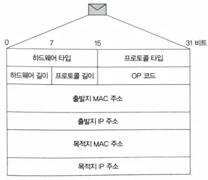
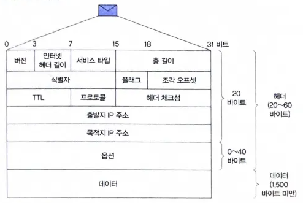
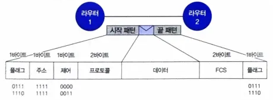

# 2.1 WAN의 개요

__WAN(Wide Area Network)__ 은 여러 LAN을 연결해 만든 광역 통신망으로, 서로 멀리 떨어진 지역 간에도 데이터를 주고받을 수 있다. WAN에서는 데이터를 패킷 단위로 전송한다.  
패킷은 TCP/IP 모델의 인터넷 계층에서 생성되며, 네트워크 인터페이스 계층의 프레임 내 데이터 필드에 담겨 전송된다.  
프로토콜이란 컴퓨터 간 통신을 하기 위해 정해 놓은 규칙을 말한다.  

__라우터(Router)__ 는 WAN에서 LAN들을 연결하는 핵심 장치로, 최적의 경로를 계산해 데이터를 목적지까지 전달한다. 라우터 간 경로 탐색 과정을 라우팅 이라고 한다.
라우팅 방식으로는 다음의 두 가지가 있다.

1. 라우팅 프로토콜 (Dynamic Routing)
    - 자동으로 최적 경로를 탐색
    - 네트워크 장애 발생 시 자동 우회 경로 설정
    - 대규모 네트워크(WAN 등)에 주로 사용
2. 스태틱 라우팅 (Static Routing)
    - 관리자가 직접 경로를 설정
    - 장애 발생 시 수동으로 수정 필요
    - 규모가 작고 변화가 적은 네트워크에 적합

 
    
스위치와 라우터 모두 데이터를 전송하지만, 주소 방식·브로드캐스트 처리·동작 계층에서 차이가 있다.

**사용 주소**

| 구분      | 스위치                  | 라우터                     |
| --------- | -------------------- | ----------------------- |
| **주소 종류** | MAC 주소 (물리적 주소)      | IP 주소 (논리적 주소)          |
| **용도**    | LAN 내 장치 구분 및 데이터 전송 | WAN 내 장치 구분 및 데이터 전송    |
| **특징**    | 장치의 네트워크 카드에 고유 부여   | 각 네트워크 인터페이스마다 고유 IP 보유 |

 

**브로드캐스트 처리**

| 구분             | 스위치            | 라우터           |
| -------------- | -------------- | ------------- |
| **브로드캐스트 범위**  | 동일 LAN 내 전송    | LAN 간 전송 차단   |
| **브로드캐스트 도메인** | 하나로 묶음         | LAN별로 분리      |
| **효과**         | LAN 내 전체 전송 가능 | 트래픽 감소, 성능 향상 |

 

**동작 계층**

| 구분            | OSI 7계층         | TCP/IP 모델     |
| ------------- | --------------- | ------------- |
| **스위치**       | 2계층 (데이터 링크 계층) | 네트워크 인터페이스 계층 |
| **라우터**       | 3계층 (네트워크 계층)   | 인터넷 계층        |
| **허브**(참고)    | 1계층 (물리 계층)     | 네트워크 인터페이스 계층 |

 
 

# 2.2 LAN에서 WAN으로 진입하기

WAN은 여러 LAN을 연결해 원거리 컴퓨터 간 데이터 통신을 가능하게 하는 네트워크이다. 예를 들어, LAN 1의 출발지 컴퓨터 → LAN 4의 목적지 컴퓨터로 데이터를 보내려면 먼저 LAN 1에서 라우터 1로 진입해야 한다.  
LAN 통신에는 MAC 주소가 필요하지만, 출발지 컴퓨터는 새로 연결된 라우터 1의 MAC 주소를 알지 못한다. IP 주소는 알고 있어도, 프레임 전송에는 MAC 주소가 반드시 필요하다.

 

## 2.2.1 ARP 패킷

ARP는 IP 주소를 이용해 MAC 주소를 알아내는 프로토콜이다.  

 

  

| 필드                          | 크기   | 설명                                     |
| --------------------------- | ---- | -------------------------------------- |
| **하드웨어 타입 (Hardware Type)** | 2바이트 | 사용 중인 네트워크 하드웨어 종류 (예: 이더넷 `0x0001`) |
| **프로토콜 타입 (Protocol Type)** | 2바이트 | IP 버전 정보 (IPv4 → `0x0800`)             |
| **하드웨어 길이 (Hardware Size)** | 1바이트 | MAC 주소 길이 (항상 `6`)                     |
| **프로토콜 길이 (Protocol Size)** | 1바이트 | IP 주소 길이 (IPv4 → `4`)                  |
| **OP 코드 (Operation Code)**  | 2바이트 | ARP 요청(`0x0001`) / ARP 응답(`0x0002`) 구분                   |
| **출발지 MAC 주소**              | 6바이트 | ARP 패킷을 보내는 컴퓨터의 MAC 주소                |
| **출발지 IP 주소**               | 4바이트 | ARP 패킷을 보내는 컴퓨터의 IP 주소                 |
| **목적지 MAC 주소**              | 6바이트 | 패킷 수신 대상의 MAC 주소                       |
| **목적지 IP 주소**               | 4바이트 | 패킷 수신 대상의 IP 주소                        |

 

출발지 컴퓨터는 라우터 1의 MAC 주소를 모르기 때문에 ARP 요청 패킷을 생성한다. 
ARP 요청 패킷에는 목적지 MAC 주소(00:00:00:00:00:00), 목적지 IP 주소(라우터 1의 IP 주소)가 담긴다.
이 패킷을 목적지 MAC 주소(브로드캐스트 주소, FF:FF:FF:FF:FF:FF), 타입 필드(0x0806, ARP 패킷) 값을 담아 이더넷 프레임에 실어 전송한다. 

전송된 패킷은 LAN 내 모든 장치에 브로드캐스트되어 라우터 1이 자신의 IP 주소와 일치함을 확인한다. 
라우터 1은 자신의 MAC 주소를 담은 ARP 응답 패킷을 생성해 요청을 보낸 컴퓨터의 MAC 주소로 ARP 응답 패킷을 전송한다. 
출발지 컴퓨터는 이 응답을 받아 라우터 1의 MAC 주소를 일정 시간 동안 ARP 캐시에 보관한다. 

 

## 2.2.2 IP 패킷

IP 패킷(IP Packet)은 데이터 전송을 위한 제어 정보(헤더)와 실제 데이터(페이로드)로 구성된다. 
헤더에는 목적지까지 데이터를 안전하게 전달하기 위한 다양한 정보가 담긴다. 

 

  

| 필드                           | 크기           | 설명                                 |
| ---------------------------- | ------------ | ---------------------------------- |
| **버전 (Version)**             | 4비트          | IP 버전 (IPv4 → `4`)                 |
| **헤더 길이 (IHL)**              | 4비트          | 헤더의 길이 (기본 20바이트, 값 `5`)           |
| **서비스 타입 (TOS)**             | 1바이트         | 패킷의 우선순위·지연·처리량 요구사항 지정            |
| **총 길이 (Total Length)**      | 2바이트         | 패킷 전체 크기 (헤더 + 데이터)                |
| **식별자 (Identification)**     | 2바이트         | 패킷 구분용 ID (단편화 시 구별)               |
| **플래그 (Flags)**              | 3비트          | 단편화 여부 표시                          |
| **조각 오프셋 (Fragment Offset)** | 13비트         | 단편화된 조각의 순서 표시                     |
| **TTL (Time To Live)**       | 1바이트         | 라우터 통과 시 1씩 감소, 0이 되면 폐기           |
| **프로토콜 (Protocol)**          | 1바이트         | 상위 프로토콜 식별 (ICMP=1, TCP=6, UDP=17) |
| **헤더 체크섬 (Header Checksum)** | 2바이트         | 헤더 오류 검출용                          |
| **출발지 IP 주소**                | 4바이트         | 보낸 컴퓨터의 IP 주소                      |
| **목적지 IP 주소**                | 4바이트         | 받는 컴퓨터의 IP 주소                      |
| **옵션 (Options)**             | 가변           | 추가 설정용 (거의 사용되지 않음)                |
| **데이터 (Data)**               | 최대 약 1500바이트 | 실제 전송할 데이터 내용                      |

 

출발지 컴퓨터는 IP 패킷을 이더넷 프레임에 담아 라우터 1로 전송한다.  
이때 프레임의 목적지 MAC 주소는 라우터 1의 MAC 주소, 데이터 필드에는 IP 패킷, 타입 필드에는 IPv4(0x0800)가 담긴다.  
라우터는 프레임을 받아 IP 패킷의 목적지 IP 주소를 확인하고, 다음 경로를 결정해 전송한다.  
라우터들이 최적의 경로를 찾아 패킷을 전달하는 과정이 라우팅이다.

 
 

# 2.3 라우팅

LAN에서 WAN으로 진입할 때 기본 게이트웨이(라우터 1)가 첫 관문 역할을 한다. 
기본 게이트웨이는 출발지 컴퓨터의 이더넷 프레임을 열어 IP 패킷의 목적지 IP 주소를 확인하고, 라우팅 테이블을 참조해 다음 라우터로 전송할 경로를 결정한다.

라우팅 테이블은 목적지 네트워크(IP 주소)와 다음 경유지 라우터의 IP 주소로 구성되며, 특정 네트워크로 가는 패킷은 해당 네트워크로 향하는 다음 라우터로 전송된다.

라우터가 많을 경우 수동 설정이 어렵기 때문에, 라우팅 프로토콜을 통해 자동으로 경로를 학습하고 갱신한다.
주요 프로토콜은 다음과 같다:
- RIP: 거리 벡터 알고리즘 기반의 단순한 방식
- OSPF: 링크 상태 알고리즘 기반의 효율적 프로토콜
- BGP: 대규모 네트워크(인터넷)용 외부 게이트웨이 프로토콜

 
 

  

라우터 간 데이터 전송 시에는 IP 패킷을 그대로 보내지 않고 PPP 프레임으로 감싸 전송한다.  
이는 패킷의 시작과 끝을 구분하고 충돌을 방지하기 위해서이며, PPP는 일대일 연결이므로 MAC 주소를 사용하지 않는다.  

 

| 필드명                            | 크기(Byte) | 역할                 |
| :----------------------------- | :------: | :----------------- |
| **플래그 (Flag)**                 |     1    | 프레임의 시작과 끝을 표시 |
| **주소 (Address)**               |     1    | 브로드캐스트 주소          |
| **제어 (Control)**               |     1    | 제어 정보              |
| **프로토콜 (Protocol)**            |     2    | 상위 프로토콜 구분         |
| **데이터 (Information)**          |    가변    | 실제 전송할 IP 패킷       |
| **FCS (Frame Check Sequence)** |     2    | 오류 검출용             |

 

최종 라우터는 IP 패킷의 목적지 주소를 확인해 해당 주소가 자신과 연결된 로컬 네트워크에 있는 것을 파악한다.  
만약 목적지 장치의 MAC 주소를 모를 경우, ARP 요청을 통해 이를 확인한 뒤 IP 패킷을 이더넷 프레임에 담아 로컬 네트워크로 전송한다.  
이 과정을 통해 IP 패킷은 최종적으로 목적지 장치에 도달한다.

# 실습

[와이어샤크로 LAN → WAN → LAN 구조 살펴보기](https://ctrl-shit-esc.tistory.com/203)