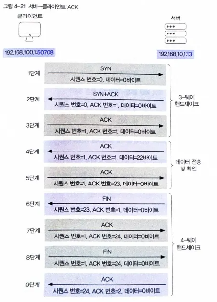

# 4.1 포트

컴퓨터 간 통신에서는 **포트**를 이용해 여러 애플리케이션을 구분한다. 
같은 컴퓨터에서 웹 브라우저(HTTP), 원격 접속(SSH), 파일 전송(FTP) 등이 동시에 실행될 때, 각 애플리케이션은 고유한 포트 번호를 사용한다. 
포트는 IP 주소(집 주소) 내에서 특정 프로그램(방 번호) 을 식별하는 역할을 하며, 수신한 데이터를 올바른 애플리케이션으로 전달하도록 돕는다. 

포트는 사용 목적에 따라 다음 세 가지로 구분된다.
1. 잘 알려진 포트(0~1023번): 인터넷 표준 프로토콜을 위해 예약된 포트, IANA에서 관리하며, 특정 서비스가 항상 동일한 포트를 사용하도록 약속되어 있음
2. 등록된 포트(1024~49151번): 기업이나 단체가 자체 개발한 서비스나 애플리케이션용으로 사용하는 포트, IANA에 등록 신청 후 사용 가능하며, 특별한 취소 요청이 없으면 계속 유지됨.
3. 동적 포트(49152~65535번): 특정 서비스에 고정되지 않고 임시로 할당됨, 운영체제가 필요할 때마다 자동으로 선택해 사용.

두 컴퓨터가 통신할 때는 같은 프로토콜을 사용하더라도 서로 다른 포트를 사용할 수 있다. 
일반적으로 서버는 고정된 잘 알려진 포트(예: 80번 HTTP), 클라이언트는 임시로 할당된 동적 포트(예: 50000번)를 사용한다. 
HTTP 통신 과정은 다음과 같다.
1. 클라이언트가 서버의 80번 포트로 연결 요청을 보냄.
2. 서버는 내부 애플리케이션 중 80번 포트를 사용하는 웹 서버에 요청을 전달함.
3. 웹 서버가 연결 가능 응답을 보내면, 서버는 이를 클라이언트에 전달함.
4. 클라이언트가 연결하겠다고 응답하면 연결이 성립됨.

이때 형성된 통신의 끝점을 소켓(Socket)이라 하며, 소켓은 IP 주소와 포트 번호의 조합(`IP:Port`)으로 표현된다.

 
 

# 4.2 TCP

IP 프로토콜은 출발지와 목적지 IP 주소를 포함한 IP 패킷을 전송하며, 라우터가 이를 기반으로 라우팅을 수행한다. 하지만 패킷의 유실, 순서 변경, 손상 여부를 확인하지 않기 때문에 신뢰성이 없다. 

TCP 프로토콜은 이러한 IP의 한계를 보완해 신뢰성 있는 데이터 전송을 보장한다. 
TCP는 연결 지향형 프로토콜로, 통신 전 소켓을 통해 연결을 설정하고 통신이 끝날 때까지 유지한다. 
데이터를 보낼 때마다 응답(ACK)을 확인해 도착 여부를 검증하고, 오류나 응답 없음 시 재전송하여 데이터 유실, 순서 오류, 손상 없이 안정적인 통신이 가능하다. 

TCP의 데이터 전송 단위는 세그먼트(Segment) 이며, 이는 IP 패킷의 데이터 필드에 담겨 전송된다. 
프레임(1계층) → IP 패킷(2계층) → TCP 세그먼트(3계층)으로 전송된다. 
IP 패킷에는 프로토콜 필드가 있어, 데이터가 어떤 프로토콜을 사용하는지 표시한다. TCP 세그먼트일 경우 값은 6이다. 
 

  

| 필드     | 크기   | 설명                               |
| ------ | ---- | -------------------------------- |
| 출발지 포트 | 2B   | 송신 애플리케이션의 포트 번호                 |
| 목적지 포트 | 2B   | 수신 애플리케이션의 포트 번호                 |
| 시퀀스 번호 | 4B   | 데이터 순서 식별 (바이트 단위 증가)            |
| ACK 번호 | 4B   | 다음에 수신 기대하는 시퀀스 번호               |
| 헤더 길이  | 4bit | 헤더 크기(4바이트 단위)                   |
| 예약     | 6bit | 미사용, 0으로 설정                      |
| 플래그    | 6bit | 연결/전송 상태 제어 (예: SYN, ACK, FIN 등) |
| 윈도우 크기 | 2B   | 한 번에 전송 가능한 데이터 양                |
| 체크섬    | 2B   | 오류 검출용 값                         |
| 긴급 포인터 | 2B   | 긴급 데이터 끝 위치 (URG 플래그 시 사용)       |
| 옵션     | 가변   | 윈도우 크기 조정 등                      |
| 패딩     | 가변   | 헤더를 4바이트 단위로 맞춤                  |
| 데이터    | 가변   | 응용 계층에서 전달된 실제 전송 데이터            |

 

멀리 떨어져 있는 클라이언트와 서버, 두 컴퓨터가 TCP 프로토콜을 이용해 어떻게 통신하는지 알아보자. 
서버의 현재 날짜와 시간을 알기 위해 통신한다고 가정할 때, 클라이언트와 서버의 소켓 정보는 다음과 같다. 
| 구분    | IP 주소         | 포트 번호             | 소켓                  |
| ----- | ------------- | ----------------- | ------------------- |
| 클라이언트 | 192.168.100.1 | 50708 (동적 포트)     | 192.168.100.1:50708 |
| 서버    | 192.168.10.1  | 13 (Daytime 프로토콜) | 192.168.10.1:13     |

 

두 컴퓨터 간에 TCP 연결 설정은 **3-way handshake**의 세 단계를 거친다. 
| 단계 | 방향         | 플래그           | 시퀀스 번호 | ACK 번호 | 설명                |
| -- | ---------- | ------------- | ------ | ------ | ----------------- |
| 1  | 클라이언트 → 서버 | **SYN**       | 0      | -      | 서버에 연결 요청(SYN)     |
| 2  | 서버 → 클라이언트 | **SYN + ACK** | 0      | 1      | 연결 요청 수락(ACK) 및 응답(SYN)     |
| 3  | 클라이언트 → 서버 | **ACK**       | 1      | 1      | 서버의 응답 확인 및 연결 확정(ACK) |

 

Daytime 프로토콜은 TCP 연결이 맺어지면 서버가 즉시 날짜·시간 데이터(22바이트)를 클라이언트에 전송한다. 

| 단계  | 방향         | 플래그 | 시퀀스 번호 | ACK 번호 | 설명                           |
| -- | ---------- | --- | ------ | ------ | ---------------------------- |
| 4 | 서버 → 클라이언트 | **ACK** | 1      | 1      | 서버가 날짜·시간 데이터(22바이트)를 전송            |
| 5 | 클라이언트 → 서버 | **ACK** | 1      | 23     | 클라이언트가 데이터 수신 완료를 확인(ACK) |

ACK 번호를 통해 몇 번째 바이트까지 잘 받았는가를 지속적으로 알린다. 
데이터가 손실·중복·순서 오류로 도착하면 수신 측은 ACK 번호를 증가시키지 않고 동일한 번호를 반복 전송하고, 송신 측은 이를 감지해 누락된 데이터부터 재전송한다. 

 

두 컴퓨터 간에 TCP 연결 종료는 **4-way handshake**의 네 단계를 거친다. 

| 단계  | 방향         | 플래그 | 시퀀스 번호 | ACK 번호 | 설명                                |
| --- | ---------- | --- | ------ | ------ | --------------------------------- |
| 6단계 | 서버 → 클라이언트 | FIN | 23     | 1      | 서버가 더 이상 보낼 데이터가 없어 연결 종료 요청(FIN) |
| 7단계 | 클라이언트 → 서버 | ACK | 1      | 24     | 클라이언트가 서버의 FIN 요청을 수락(ACK)        |
| 8단계 | 클라이언트 → 서버 | FIN | 1      | 24     | 클라이언트도 연결 종료 요청(FIN)              |
| 9단계 | 서버 → 클라이언트 | ACK | 24     | 2      | 서버가 클라이언트의 FIN 요청을 수락(ACK)        |

 
전체 TCP 연결을 정리하면 다음과 같다. 
  

 
 

# 4.3 UDP

다음은 TCP와 UDP를 비교한 것이다. 
  

| 구분         | TCP                                 | UDP                       |
| ---------- | ----------------------------------- | ------------------------- |
| **방식**     | 연결 지향형 (Connection-oriented)        | 비연결형 (Connectionless)     |
| **연결 절차**  | 데이터 전송 전 3-way handshake로 연결 설정     | 연결 설정 없이 바로 전송            |
| **신뢰성**    | 데이터 손실·순서 오류 확인 및 재전송으로 신뢰성 보장      | 오류 확인 및 재전송 없음 (신뢰성 낮음)   |
| **속도**     | 상대적으로 느림                            | 매우 빠름                     |
| **사용 예시**  | 웹 통신(HTTP), 이메일(SMTP), 파일 전송(FTP) 등 | 실시간 스트리밍, 화상 통화, 온라인 게임 등 |
| **데이터 단위** | 세그먼트(Segment)                       | 데이터그램(Datagram)           |

 
 

UDP의 데이터그램은 다음과 같은 구조로 이루어져 있다. 
  

| 필드                       | 크기   | 설명               |
| ------------------------ | ---- | ---------------- |
| 출발지 포트(Source Port)      | 2바이트 | 송신 애플리케이션의 포트 번호 |
| 목적지 포트(Destination Port) | 2바이트 | 수신 애플리케이션의 포트 번호 |
| 길이(Length)               | 2바이트 | 헤더 + 데이터 전체 길이   |
| 체크섬(Checksum)            | 2바이트 | 데이터 오류 검출용       |
| 데이터(Data)                | 가변   | 실제 전송할 응용 계층 데이터 |

 

