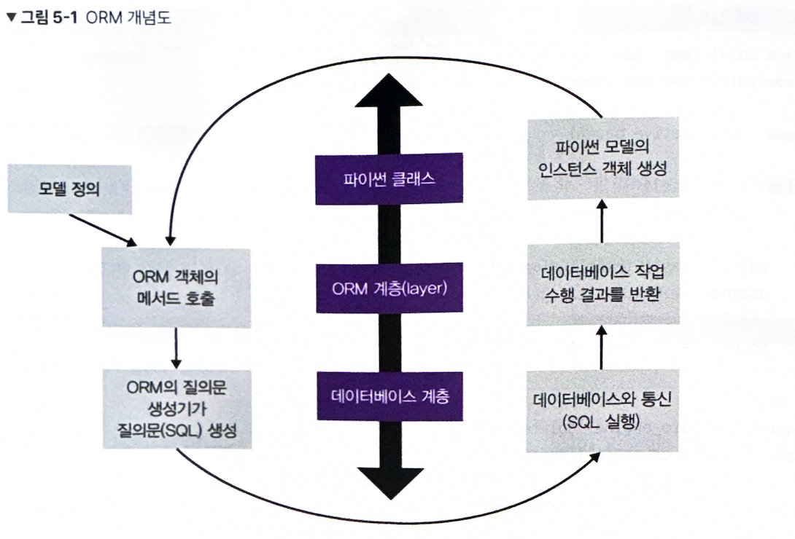

# 5. ORM으로 모델링하기

## 5.1 파이썬에서 데이터베이스를 사용하는 방법: SQLModel

### 5.1.1 SQL과 ORM

SQL이 프로그래밍 언어라는 의미는 프로그램은 컴퓨터가 일을 하게 체계이자 방법이고, 그런 프로그램을 작성하는 언어라는 맥락.

SQL은 데이터베이스에서 데이터를 다루는 언어로, **선언형 언어**  
선언형이란 "어떻게"가 아니라 "무엇을"에 사고 중심을둔 체계를 말하며, 다른 선언형 언어로는 HTML과 스프레드시트가 있다.  
여기서 무엇이란 상태라고도 할 수 있으며 설명이란 그 상태가 되는 관계를 기술한다는 뜻이다. 즉, 결과 상태가 되기 위해 데이터들 사이에 어떤 조건이나 관계가 성립해야 하는지를 적는다.  
따라서 선언형 언어는 **최종적으로 어떤 상태를 원하는지**를 작성한다.

**절차형 언어**는 **어떻게 단계별로 처리할지**를 작성한다. 
예를 들어, 17시에 우리 집에서 보자고 약속을 잡는 것은 선언형이고, 우리 집까지 오는 방법(지하철을 타고...)는 절차형이다.  
우리는 행동은 절차형으로 할지라도 생각을 하거나 소통을 할 때는 선언형으로 하는 편이다.

우리가 프로그래밍 언어로 무언가를 실행하고 처리한다는 건 어떤 상태에 이르기 위한 실행 과정을 사고하는 것이므로 행동 중심 사고에 대응시켜 서술하기 용이해 프로그래밍에서 절차형 패러다임이 큰 비중을 차지한다. 
절차형 패러다임은 데이터를 프로그램의 중심에 놓고 프로그램을 구현하는 게 아니라 행동하는 객체 또는 주체의 프로그램의 핵심을 두고 있다. 
Python으로 SQL을 다루는 것은 절차형 체계 안에서 선언형 체계를 다룬다는 의미이다. 
따라서 명령형으로 사고하며 코드를 작성하다가 영속 데이터 계층에서는 선언형으로 사고방식을 전환해야 한다. 이러한 전환은 인지 부하를 일으킨다.

**ORM**은 Object-Relational Mapping의 약자로, 한국어로 번역하면 객체 관계 대응이다.
- Object: 객체는 행동과 상태를 함께 갖는 존재이다. 객체는 다른 객체와 메시지를 주고받으며 협력하는데 이 말에는 상태, 행동, 다른 객체에 대한 방향과 의존이 담겨 있다.(= 절차, 명령)
- Relational: 값과 값이 갖는 상태와 관계를 다룬다는 의미이다.
- Mapping: 서로 다른 Object와 Relational을 대응시킨다는 의미이다.

정리하면 ORM은 선언형 관계 모델을 객체 사고에 맞게 변환하려는 시도이자 기술이다. 
ORM을 사용하면 선언형 언어(SQL)를 객체 중심으로 절차와 방향을 갖고 사고하는 데 도움이 된다. 
중요한 것은 ORM이 SQL문을 감춘 것이 아니라 SQL의 선언형 사고방식과 사고모델을 김춰 객체 지향, 절차형 체계로 사고하고 다룰 수 있도록 했다는 것이다.    

 

- 파이썬이 관계형 데이터베이스의 테이블을 추상화한 모델을 정의한다. 모델을 인스턴스 객체로 만들면 ORM 계층을 거쳐 처리된 데이터베이스 테이블의 행 하나에 매핑된다.
- ORM에 내장된 질의문 생성기가 SQL 질의문을 생성하고, 이를 데이터베이스와 통신한다.
- 질의문을 실행하여 결과가 나오면 해당 데이터를 가져온 후 모델에 매핑해 파이썬 인스턴스 객체로 변환한다.

 

### 5.1.2 SQLAlchemy

Python 생태계에서 널리 사용되는 ORM 라이브러리 중 하나이다.  
SQLAlchemy를 ORM으로 활용하는 데 있어서 중요한 요소 3가지
- Engine을 이용해 다양한 데이터베이스와 연결 가능
- Session을 이용해 DB 연결 세션 관리
- 선언형 모델: 파이썬 클래스를 이용해 데이터베이스 테이블의 데이터를 선언적으로 사용하는 기법

 

### 5.1.3 Pydantic

파이썬의 타입 힌트를 적극 활용하여 데이터가 주어졌을 때 해당 데이터의 형식이 올바른지 등을 쉽게 검증해주는 데이터 구조체 도구 
dict가 값을 담은 컨테이너로 유연하고 편하게 사용할 수는 있지만, 지나치게 유연하고 기호를 많이 사용한다는 단점이 있다.  
데이터 클래스는 자료형 각주로 데이터의 필드를 선언하여 dict보다 가독성이 좋다.  
Pydantic은 입력 데이터가 사용자가 기대하는 자료형과 형식을 갖추고 있는지 검증해서 필요하다면 자료형을 변환하여 일관된 데이터 구조를 보장하지만, ORM은 파이썬 클래스로 된 모델을 RDBMS 테이블에 매핑하여 데이터를 다루는 도구라는 점에서 차이가 있다.

 

### 5.1.4 SQLModel

Pydantic의 데이터 유효성 검증과 SQLAlchemy의 ORM을 하나로 통합하여 편의성을 높인 도구이다. 
SQLAlchemy Model 데이터를 FastAPI가 다루기 위해서는 일일이 Pydantic으로 변환해야 하는데, 이런 불편한 단계를 SQLModel을 통해 줄인다.

 
 

# 