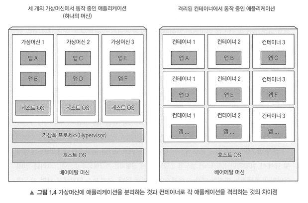
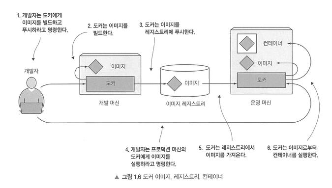

# 1장. 쿠버네티스 소개

대부분의 소프트웨어 애플리케이션은 하나의 프로세스 또는 몇 개의 서버에 분산된 프로세스로 실행되는 거대한 모놀리스였다.  
이런 레거시 시스템은 릴리스 주기가 느리고 비교적 업데이트가 자주 되지 않았다. 
거대한 모놀리스 레거시 애플리케이션은 점차 마이크로서비스라는 독립적으로 실행되는 더 작은 구성 요소로 세분화되고 있다. 
마이크로서비스는 서로 분리되어 있기 때문에 개별적으로 개발, 배, 업데이트, 확인할 수 있고 신속하게 자주 구성 요소를 변경할 수 있게 되었다. 
하지만 배포 가능한 구성 요소 수가 많아지고 구성 요소의 서버 배포를 자동으로 스케줄링하고 구성, 관리, 장애 처리를 포함하는 자동화가 필요해져 **쿠버네티스**가 등장하게 되었다. 
시스템 관리자의 관심은 개별 애플리케이션을 감독하는 것에서 쿠버네티스와 나머지 인프라를 감독하고 관리하는 것으로 바뀌고 애플리케이션은 쿠버네티스가 관리해준다. 
쿠버네티스는 하드웨어 인프라를 추상화하고 데이터 센터 전체를 하나의 거대한 컴퓨팅 리소스로 제공한다.

 

## 1.1 쿠버네티스와 같은 시스템이 필요한 이유

모놀리스 애플리케이션은 모든 것이 서로 강하게 결합돼 있고, 전체가 하나의 운영체제 프로세스로 실행되기 때문에 하나의 개체로 개발, 배포, 관리돼야 한다. 
또한 모놀리스 애플리케이션을 실행하려면 애플리케이션을 실행하는 데 충분한 리소스를 제공할 수 있는 서버가 필요한데, 시스템의 증가하는 부하를 처리하기 위해 서버를 수직 확장(scale-up)하거나 수평 확장(scale-out) 해야 한다. 
수직 확장은 비용이 많이 들고 확장에 한계가 있으며, 수평 확장은 상대적으로 저렴하지만 애플리케이션 코드의 변경이 필요할 수 있으며 항상 가능한 것도 아니다. 
따라서 복잡한 모놀리스 애플리케이션을 마이크로서비스라는 독립적으로 배포할 수 있는 작은 구성 요소로 분할해 각 마이크로서비스별로 가장 적합한 방식으로 개발 가능하며, 리소스가 더 필요한 서비스만 별도로 확장 가능하다. 
하지만 마이크로서비스는 구성 요소가 많아질수록 구성 요소 간의 상호 종속성 수가 훨씬 더 많아지므로 배포 관련 결정이 점점 어려워지고, 실행 호출을 디버그하고 추적하기 어렵다는 단점이 있다.

또한 개발과 프로덕션 환경 사이에는 차이가 발생할 수 밖에 없으며, 각 프로덕션 머신 간에도 차이가 있다. 게다가 프로덕션 머신은 하드웨어, 운영체제, 라이브러리 등 시간이 지남에 따라 변한다. 
따라서 프로덕션 환경에서만 나타나는 문제를 줄이려면 애플리케이션 개발과 프로덕션이 정확히 동일한 환경에서 실행돼 운영체제, 라이브러리, 시스템 구성, 네트워킹 환경, 기다 모든 것이 동일한 환경을 만들고 시간이 니잠에 따라 환경이 너무 많이 변하는 것을 방지할 수 있다면 좋을 것이다.

DevOps란 개발자, QA, 운영 팀이 전체 프로세스에서 협업하는 문화이다. 
최신 버전의 애플리케이션을 더 자주 릴리스하려면 배포 프로세스를 간소화해야 한다. 가장 좋은 방법은 개발자가 직접 애플리케이션을 배포하는 것이지만 배포에 필요한 인프라와 데이터 센터의 기본 하드웨어 구성에 관한 정보를 잘 알지 못하는 경우가 많다. 
하드웨어 인프라를 전혀 알지 못하더라도 운영 팀을 거치지 않고 개발자가 애플리케이션을 직접 배포하는 방식을 NoOps라고 하는데, 이것이 가상 이상적인 방법이다. 
쿠버네티스를 사용하면 하드웨어를 추상화하고 이를 애플리케이션 배포, 실행을 위한 플랫폼으로 제공함으로써 개발자는 시스템 관리자의 도움 없이도 애플리케이션을 구성, 배포할 수 있으며 시스템 관리자는 실제 실행되는 애플리케이션을 알 필요 없이 인프라를 유지하고 운영하는 데 집중할 수 있다.

 

## 1.2 컨테이너 기술 소개

  
쿠버네티스는 애플리케이션을 격리하는 기능을 제공하기 위해 리눅스 컨테이너 기술을 사용한다. 
리눅스 컨테이너 기술을 사용하면 동일한 호스트 시스템에서 여러 개의 서비스를 실행할 수 있으며 동시에 서로 다른 환경을 만들어줄 뿐만 아니라 가상머신보다 오버헤드가 훨씬 적다. 

| 구분        | 컨테이너                                | 가상 머신(VM)                            |
| --------- | ----------------------------------- | ------------------------------------ |
| 가상화 대상    | 운영체제 수준에서 프로세스를 격리                  | 하드웨어 수준에서 운영체제 전체를 가상화               |
| 운영체제 구조   | 호스트 OS의 커널을 모든 컨테이너가 공유             | 각 VM이 별도의 게스트 OS와 커널을 가짐             |
| 실행 단위     | 애플리케이션과 필요한 라이브러리                   | 애플리케이션, 라이브러리, 게스트 OS, 시스템 서비스       |
| 리소스 사용량   | 애플리케이션이 필요한 자원만 사용하므로 적음            | 게스트 OS와 시스템 프로세스 실행으로 자원 사용량이 큼      |
| 오버헤드      | 낮음                                  | 상대적으로 높음                             |
| 시작 속도     | 별도 OS 부팅 없이 프로세스가 즉시 시작됨            | 게스트 OS를 부팅해야 하므로 상대적으로 느림            |
| 격리 수준     | 프로세스는 격리되지만 호스트 커널을 공유              | 각 VM이 독립된 OS와 커널을 사용해 격리 수준이 높음      |
| 적합한 상황    | 많은 애플리케이션을 빠르고 효율적으로 배포할 때          | 강한 격리 또는 서로 다른 운영체제가 필요할 때           |
| 대표 장점     | 가벼움, 빠른 시작, 높은 배포 밀도                | 강한 격리, 독립적인 운영체제 환경                  |
| 대표 단점     | 커널 공유에 따른 보안·호환성 제약                 | 높은 리소스 사용량과 부팅 오버헤드                  |

컨테이너의 프로세스 격리는 두 가지 메커니즘으로 작동한다.
1. namespace: 각 프로세스가 시스템(파일, 프로세스, 네트워크 인터페이스, 호스트 이름 등)에 대한 독립된 뷰만 볼 수 있음
2. cgroups: 프로세스가 사용할 수 있는 리소스(CPU, 메모리, 네트워크 대역폭 등)의 양을 제한함

 

파일시스템, 프로세스 ID, 사용자 ID, 네트워크 인터페이스 등과 같은 모든 시스템 리소스는 하나의 네임스페이스에 속하며, 프로세스는 동일한 네임스페이스 내에 있는 리소스만 볼 수 있다. 
각 네임스페이스는 특정 리소스 그룹을 격리하는 데 사용된다. 예를 들어 네임스페이스 내에서 실행 중인 프로세스가 사용할 호스트 이름과 도메인 이름을 결정하는 UTS 2개를 한 쌍의 프로세스에 각각 지정하면 서로 다르ㅏㄴ 로컬 호스트 이름을 보게 해 마치 두 개의 다른 시스템에서 실행 중인 것처럼 보이게 할 수 있다. 
컨테이너 격리의 나머지 부분은 컨테이너가 사용할 수 있는 시스템 리소스의 양을 제한하는 것인데, 이는 프로세스의 리소스 사용을 제한하는 리눅스 커널 기능인 cgroups로 이뤄진다.

 

Docker는 컨테이너를 여러 시스템에 쉽게 이식 가능하게 하는 컨테이너 시스템이다. 
애플리케이션뿐만 아니라 라이브러리, 종속성, 심지어 전체 운영체제 파일시스템까지도 도커를 실행하는 다른 컴퓨터에 애플리케이션을 프로비저닝하는 데 사용할 수 있는 이식 가능한 패키지인 컨테이너 이미지로 묶기 쉽게 만들었다. 
도커로 패키징된 애플리케이션을 실행하면 함께 제공된 파일시스템 내용을 정확하게 볼 수 있다. 프로덕션 환경 서버가 완전히 다른 리눅스 운영체제를 실행하더라도 어느 머신에서 실행되는지에 관계없이 동일한 파일을 볼 수 있다. 
도커 기반 컨테이너 이미지와 가상머신 이미지의 큰 차이점은 이미지가 여러 이미지에서 공유되고 재사용될 수 있는 레이어로 구성되어 있다는 점이다. 즉, 동일한 레이어를 포함하는 다른 컨테이너 이미지를 실행할 때 다른 레이어가 이미 다운로드된 경우 이미지의 특정 레이어만 다운로드하면 된다.

 

 
도커는 애플리케이션을 패키징, 배포, 실행하기 위한 플랫폼이다. 도커의 세 가지 주요 개념은 다음과 같다.
- 이미지: 애플리케이션과 해당 환경을 패키지화한 것
- 레지스트리: 도커 이미지를 저장하고 다른 사람이나 컴퓨터 간에 해당 이미지를 쉽게 공유할 수 있는 저장소, 이미지를 레지스트리로 push 한 뒤 다른 컴퓨터에서 이미지를 pull한다.
- 컨테이너: 도커 기반 컨테이너 이미지에서 생성된 일반적인 리눅스 컨테이너, 도커를 실행하는 호스트에서 실행하는 프로세스지만 호스트나 다른 프로세스와 격리되어 있다.

 
 

도커 이미지는 레이어로 구성되어 있다. 모든 도커 이미지는 다른 이미지 위에 빌드되며 두 개의 다른 이미지는 기본 이미지로 동일한 부모 이미지를 사용할 수 있다. 
이렇게 하면 첫 번째 이미지의 일부로 전송된 레이어를 다른 이미지를 전송할 때 다시 전송할 필요가 없기 때문에 네트워크로 이미지를 배포하는 속도가 빨라지고 이미지의 스토리지 공간을 줄일 수 있다. 
컨테이너 이미지 레이어는 읽기 전용이고 컨테이너가 실행될 때 이미지 레이어 위에 새로운 쓰기 가능한 레이어가 만들어진다. 컨테이너의 프로세스가 기본 레이어 중 하나에 잇는 파일에 쓰면 전체 파일의 복사본의 최상위 레이어에 만들어지고 프로세스는 복사본에 쓴다.

 

