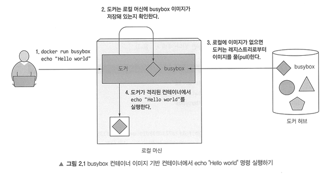
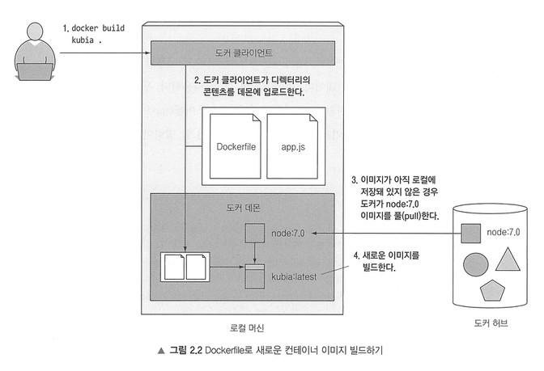
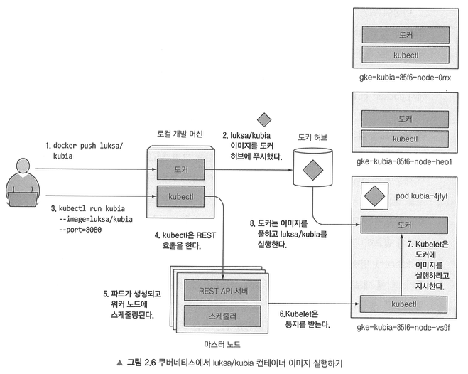
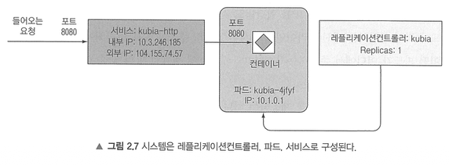

# 2장. 도커와 쿠버네티스 첫걸음

## 2.1 도커를 사용한 컨테이너 이미지 생성, 실행, 공유하기

 
그림은 busybox 컨테이너를 통해 docker run 명령어를 수행했을 때 일어나는 일을 보여준다. 
1. `busybox:latest` 이미지가 로컬 컴퓨터에 존재하는지 체크하고, 존재하지 않으면 docker.io의 도커 허브 레지스트리에서 이미지 다운로드
2. 도커는 이미지로부터 컨테이너를 생성하고 내부에서 명령어 실행

 

도커는 동일한 이미지와 이름에 여러 개의 버전을 가질 수 있다. 각 버전은 고유한 태그를 가져야 하며, 이미지를 참조할 때 명시적으로 태그를 지정하지 않으면 latest가 지정된다. 
애플리케이션은 HTTP 요청을 받아 애플리케이션이 실행 중인 머신의 호스트 이름을 응답으로 반환한다. 이런 동작 방식이 쿠버네티스 위에 애플리케이션을 배포하고 스케일 아웃을 할 때 유용하게 사용된다. 
애플리케이션을 이미지로 패키징하기 위해 Dockerfile이라는 도커가 이미지를 생성하기 위해 수행해야 할 지시 사항이 담긴 파일을 생성해야 한다.
- FROM: 시작점(기본 이미지)로 사용할 컨테이너 이미지 정의
- ADD: 로컬 디렉터리에서 이미지에 추가할 파일
- ENTRYPOINT: 이미지를 싫애했을 때 수행돼야 할 명령어

 

 
빌드 프로세스는 디렉터리의 전체 콘텐츠가 도커 데몬에 업로드되고 그곳에서 이미지가 빌드된다. 도커 클라이언트는 호스트 OS에 위치하고, 데몬은 가상머신 내부에서 실행된다. 
빌드 프로세스 동안 이미지가 사용자 컴퓨터에 저장되어 있지 않으면 기본 이미지를 퍼블릭 이미지 repository에서 가져온다. 그 뒤 이미지를 빌드한다. 
이미지는 하나의 큰 바이너리 덩어리가 아니라 여러 개의 레이어로 구성되어 있기 때문에 이미지의 저장과 전송에 효과적이다. 예를 들어 동일한 기본 이미지를 바탕으로 다수의 이미지를 생성하더라도 기본 이미지를 구성하는 모든 레이어는 한 번만 저장된다. 또한 이미지를 가져올 때도 각 레이어를 개별적으로 다운로드한다. 
Dockerfile이 이미지를 빌드하는 동안 기본 이미지의 모든 레이어를 가져온 다음, 그 위에 새로운 레이어를 생성하고 로컬 디렉터리에서 가져온 파일을 그 위에 추가한다. 
그런 다음 이미지가 실행할 때 수행돼야 할 명령을 지정하는 또 하나의 레이어를 추가하고 latest 태그를 추가한다. 
이미지 빌드 프로세스가 완료되면 새로운 이미지가 로컬에 저장된다.

 

`docker run` 명령어를 실행해 도커가 이미지를 통해 새로운 이름의 컨테이너를 띄운다. 
각 컨테이너는 격리된 파일시스템을 갖고 있어 컨테이너 내부에서 루트 디렉터리의 내용을 조회해보면 컨테이너 안의 파일만 보인다. 
`docker stop` 명령어를 실행하면 컨테이너에 실행 중인 메인 프로세스를 중지시키며 컨테이너 내부에 실행 중인 다른 프로세스가 없으므로 결과적으로 컨테이너가 중지된다. 
`docker ps -a`로 보면 컨테이너 그 자체는 존재하므로 컨테이너를 완전히 삭제하려면 `docker rm` 명령을 수행해야 한다. 
빌드한 이미지를 다른 컴퓨터에서도 실행하려면 외부 이미지 저장소에 이미지를 푸시해야 한다. 공개 이미지 레지스트리에는 dockerhub나 GCR 등이 있다.

 

## 2.2 쿠버네티스 클러스터 설치

올바른 쿠버네티스 설치는 여러 물리 머신 또는 가상 머신에 걸쳐 수행되며 쿠버네티스 클러스터 내에서 실행되는 모든 컨테이너가 동일한 플랫 네트워킹 공간을 통해 서로 연결되도록 네트워크를 올바르게 설정해야 한다. 
쿠버네티스는 로컬 개발 머신, 클라우드 공급자에서 제공된 가상 머신, 관리형 쿠버네티스 클러스터 등을 통해 사용할 수 있다. 
minikube를 통해 손쉽게 단일 노드 쿠버네티스 클러스터를 설치할 수 있다. 이때 darwin은 애플이 개발한 오픈소스 Unix 계열 운영체제 커널이다. 
다중 노드 쿠버네티스 클러스터는 GKE를 통해 사용할 수 있다. GKE를 사용하면 모든 클러스터 노드와 네트워킹을 수동으로 설정할 필요가 없어 부담을 덜어준다. (하지만 그만큼 비싸다.) 
GKE로 생성한 쿠버네티스 클러스터의 각 노드는 도커, kubelet, kube-proxy를 실행한다. kubectl 클라이언트 명령어는 마스터 노드에서 실행 중인 쿠버네티스 API 서버로 REST 요청을 보내 클러스터와 상호작용한다.

kubectl을 사용할 때 `~/.bashrc` 파일에 `alias k=kubectl`로 별칭을 추가해두면 매번 kubectl을 입력할 필요가 없어진다. 
bash-completion 패키지를 설치하면 bash에서 탭 완성을 활성화할 수 있다.

 

## 2.3 쿠버네티스에 첫 번째 애플리케이션 실행하기

보통 쿠버네티스에 애플리케이션을 배포하려면 모든 구성 요소를 기술한 json이나 yaml 매니페스트를 준비해야 한다. 하지만 간단히 애플리케이션을 배포하기 위해 이미지를 가져와 레플리케이션컨트롤러로 배포할 수도 있다. 
쿠버네티스는 컨테이너를 그룹으로 묶어 파드라고 한다. 파드는 하나 이상의 밀접하게 연관된 컨테이너의 그룹으로 같은 워커 노드에서 같은 리눅스 네임스페이스로 함께 실행된다. 
각 파드는 자체 IP, 호스트 이름, 프로세스 등이 있는 논리적으로 분리된 머신이다. 
애플리케이션은 단일 컨테이너로 실행되는 단일 프로세스일 수도 있고, 개별 컨테이너에서 실행되는 주 애플리케이션 프로세스와 부가적으로 도와주는 프로세스로 이뤄질 수도 있다. 
파드에서 실행 중인 모든 컨테이너는 동일한 논리적인 머신에서 실행하는 것처럼 보이는 반면, 다른 파드에서 실행 중인 컨테이너는 같은 워커 노드에서 실행 중이라 할지라도 다른 머신에서 실행 중인 것으로 나타난다.

 
이미지를 빌드해 도커 허브에 푸시하면 도커 데몬이 실행 중인 다른 워커 노드에서 컨테이너 이미지에 접근할 수 있다. 
kubectl 명령어를 실행하면 쿠버네티스의 API 서버로 REST HTTP 요청을 전달하고 클러스터에 새로운 ReplicationController 오브젝트를 생성한다. 
ReplicationController는 새 파드를 생성하고 스케줄러에 의해 워커 노드 중 하나에 스케줄링이 된다. 
해당 워커 노드의 kubelet은 파드가 스케줄링됐다는 것을 보고 이미지가 로컬에 없기 때문에 도커에게 레지스트리에서 특정 이미지를 pull하도록 지시한다. 
이미지를 다운로드한 후 도커는 컨테이너를 생성하고 실행한다.

실행 중인 파드는 자체 IP 주소를 가지고 있지만 이 주소는 클러스터 내부에 있으며 외부에서 접근이 불가능하다. 
외부에서 파드에 접근을 가능하게 하려면 서비스 오브젝트를 통해 노출해야 한다. 파드와 마찬가지로 일반적인 ClusterIP Service를 생성하면 클러스터 내부에서만 접근 가능하기 때문에 Load Balancer 유형의 서비스를 생성해 외부 로드 밸런서의 public ip를 통해 파드에 연결해야 한다. 
앞서 생성한 ReplicationController 오브젝트를 expose하여 서비스를 생성할 수 있다.

 
마스터 노드는 단일 마스터 노드에서 호스팅 중인지 혹은 여러 대의 마스터 노드에 분산된 것인지 알 수 없다. 단지 단일 엔드포인트로 접근 가능한 API 서버를 통해 상호작용하고 있기 때문에 큰 상관이 없다. 
쿠버네티스는 kubectl run 명령이 실행되면 ReplicationController를 생성하고, ReplicationController가 실제 파드를 생성한다. 
클러스터 외부에서 파드에 접근하기 위해 쿠버네티스에게 ReplicationController에 의해 관리되는 모든 파드를 단일 서비스로 노출하도록 명령한다. 
파드는 원하는 만큼의 컨테이너를 포함시킬 수 있다. 
ReplicationController는 파드를 복제(= 파드의 복제본을 생성)하고 항상 실행 상태로 만든다. 따라서 어떤 이유로 파드가 사라진다면 ReplicationController는 사라진 파드를 대체하기 위해 새로운 파드를 생성할 것이다. 
새롭게 생성된 파드는 IP 주소를 다르게 할당받는데, 이렇게 항상 변경되는 파드의 IP 주소 문제와 여러 개의 파드를 단일 IP와 포트의 쌍으로 노출시키는 문제를 서비스로 해결할 수 있다. 
서비스가 생성되면 정적 IP를 할당받고 서비스가 존속하는 동안 변경되지 않는다. 서비스는 어떤 파드가 어떤 IP를 갖는지에 상관없이 파드 중 하나로 연결해 요청을 처리하도록 한다. 
서비스는 다수 파드 앞에서 로드밸런서 역할을 한다.

실행 중인 애플리케이션은 ReplicationController에 의해 모니터링되고 실행되며, 서비스를 통해 외부에 노출된다. 
컨트롤러의 desired 레플리카 수를 변경하면 간단하게 배포를 확장할 수 있다. 
쿠버네티스가 어떤 액션을 수행해야 하는지 정확하게 알려주는 대신에 시스템의 desired state를 선언적으로 변경하고 쿠버네티스가 실제 current state를 검사해 의도한 상태로 조정한다. 이것이 가장 기본적인 쿠버네티스 원칙 중 하나다. 
단, 애플리케이션 자체에서 수평 확장을 지원하도록 만들어야 한다. 쿠버네티스는 단지 애플리케이션의 스케일업이나 스케일다운을 간단하게 만들어줄 뿐이다. 
또한 대시보드를 통해 클러스터의 오브젝트를 조회, 생성, 수정, 삭제 가능하다.