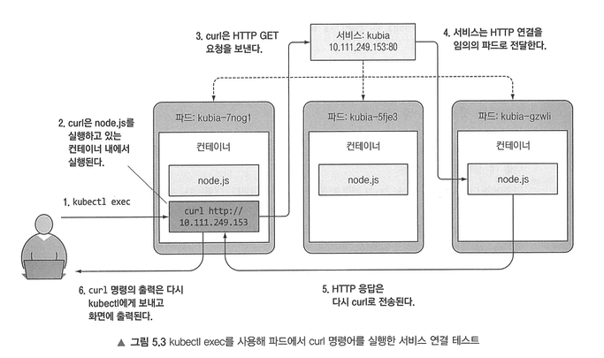
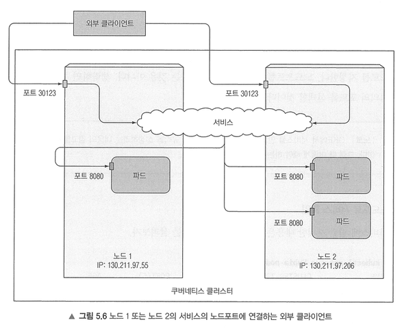
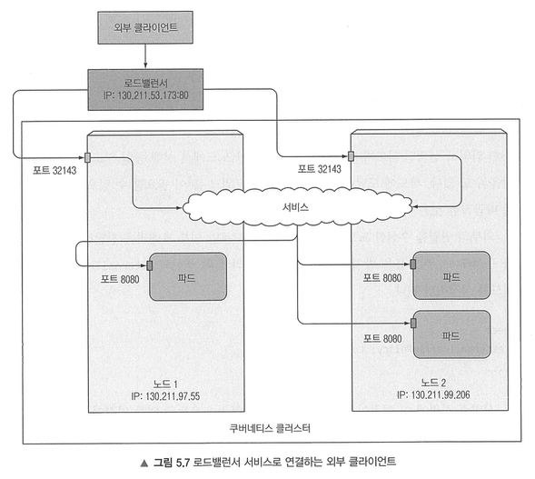
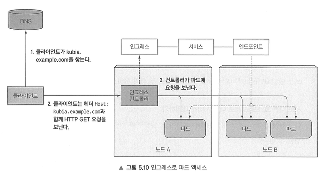

# 5. 서비스: 클라이언트가 파드를 검색하고 통신을 가능하게 함

쿠버네티스가 아닌 세계에서는 시스템 관리자가 클라이언트 구성 파일에 서비스를 제공하는 서버의 정확한 IP 주소나 호스트 이름을 지정해 각 클라이언트 애플리케이션을 구성하는 것과 달리, 쿠버네티스에서 동일한 작업을 수행하면 다음과 같은 이유로 동작하지 않는다:
- 파드: 일시적, 언제든 다른 노드로 이동할 수 있음. 고정 IP X
- 쿠버네티스는 파드가 시작되기 바로 전에 IP 주소를 할당하기 애문에 파드 IP를 미리 알 수 X
- 각 파드는 고유 IP 주소가 있으므로 수평 스케일링을 위해서는 파드의 개별 IP 목록을 유지해야 하는데, 클라이언트는 서비스를 지원하는 파드의 수와 IP에 상관하지 않아야 함

 

## 5.1 서비스 소개

서비스는 동일한 서비스를 제공하는 파드 그룹에 지속적인 단일 접점을 만들려고 할 때 생성하는 리소스다. 
각 서비스는 서비스가 존재하는 동안 절대 바뀌지 않는 IP 주소와 포트가 있다. 클라이언트는 해당 IP와 포트로 접속한 다음 해당 서비스를 지원하는 파드 중 하나로 연결된다. 
이런 방식으로 서비스의 클라이언트는 서비스를 제공하는 개별 파드의 위치를 알 필요 없으므로, 이 파드는 언제든지 클러스터 안에서 이동할 수 있다. 
프론트엔드 파드에 관한 서비스를 만들고 클러스터 외부에서 액세스할 수 있도록 구성하면 외부 클라이언트가 파드에 연결할 수 있는 하나의 고정 IP 주소가 노출된다. 백엔드 파트도 마찬가지다. 
파드의 IP 주소가 변경되더라도 서비스의 IP 주소는 변경되지 않고, 프론트엔드 파드에서 환경변수 또는 DNS 이름으로 백엔드 서비스를 쉽게 찾을 수 있다.

서비스 연결은 서비스 뒷단의 모든 파드로 로드밸런싱된다. 
서비스는 레플리케이션컨트롤러와 레플리카셋처럼 레이블 셀렉터를 사용해 동일한 세트에 속하는 파드를 지정한다. 
서비스를 생성하는 가장 쉬운 방법은 `expose` 명령어로 파드 셀렉터를 사용해 서비스 리소스를 생성하고, 모든 파드를 단일 IP 주소와 포트로 노출하는 것이다. 
[service yaml 파일](files/service.yaml)처럼 포트 80의 연결을 허용하고, 각 연결을 `app=kubia` 레이블 셀렉터와 일치하는 파드의 포트 8080으로 라우팅할 수 있다. 
서비스에 내부 cluster IP가 할당되었다면 해당 클러스터 IP를 통해 클러스터 내부에서 액세스할 수 있다.

 
1. 파드의 컨테이너 내에서 서비스 IP로 curl 명령을 실행한다.
2. curl은 HTTP 요청을 서비스 IP로 보낸다.
3. 쿠버네티스 서비스 프록시가 연결된 파드 중 임의의 파드로 요청을 전달한다.
4. 파드 내에서 실행 중인 애플리케이션은 요청을 처리하고 HTTP 응답을 반환한다.
5. curl은 표준 출력으로 응답을 출력하고 이를 kubectl이 있는 로컬 시스템의 표준 출력에 다시 표시한다.

 

동일한 명령을 실행해 동일한 클라이언트에서 요청하더라도 서비스 프록시가 각 연결을 임의의 파드를 선택해 다시 전달(forward)하기 때문에 요청할 때마다 다른 파드가 선택된다. 
특정 클라이언트의 모든 요청을 매번 같은 파드로 리디렉션하려면 서비스와 `sessionAffinity` 속성을 기본값(None) 대신 ClientIP로 설정한다. 
서비스는 TCP와 UDP 패킷을 처리하고 페이로드는 신경 쓰지 않는다. 쿠키는 HTTP 프로토콜의 구성이기 때문에 서비스는 쿠키를 알지 못해 세션 어퍼니티를 쿠키 기반으로 할 수 없다. 
세션 어퍼니티(Session Affinity)란 특정 사용자의 요청을 항상 똑같은 서버나 파드로 보내도록 유지하는 기술을 말한다. 
하나의 서비스를 사용해 멀티 포트 서비스를 사용하면 단일 클러스터 IP로 모든 서비스 포트를 노출할 수 있다. 
또한 각 파드의 포트에 이름을 지정하고 서비스 스펙에서 이름으로 참조하여 서비스 스펙을 좀 더 명확하게 할 수도 있다. 
쿠버네티스가 Pod를 생성할 때, 이미 존재하는 Service 정보를 환경 변수로 넣어 준다. 이 환경 변수를 이용해 파드에서 서비스를 통해 다른 파드를 연결할 수 있다.

`kube-dns` 파드는 DNS 서버를 실행하며 클러스터에서 실행 중인 다른 모든 파드는 자동으로 각 컨테이너의 `/etc/resolv.conf` 파일을 참고하여 이를 사용한다. 
파드에서 실행 중인 프로세스에서 수행된 모든 DNS 쿼리는 시스템에서 실행 중인 모든 서비스를 알고 있는 쿠버네티스의 자체 DNS 서버로 처리된다. 
FQDN(Fully Qualified Domain Name)은 호스트 이름과 도메인 이름 전체를 포함하여 네트워크상에서 특정 컴퓨터나 서버의 위치를 모호함 없이 정확히 가리키는 완전한 도메인 주소이다. 
프론트엔드는 `backend-database.default.svc.cluster.local` 라는 FQDN으로 백엔드 데이터베이스 서비스에 연결할 수 있다. 
여기서 backend-database는 서비스 이름이고 default는 서비스가 정의된 네임스페이스이며 svc.cluster.local은 모든 클러스터의 로컬 서비스 이름에 사용되는 클러스터의 도메인 접미사다. 
프론트엔드 파드가 데이터베이스 파드와 동일한 네임스페이스에 있는 경우 svc.cluster.local 접미사와 네임슾이스는 생략하고 단순히 backend-database로 서비스에 접근 가능하다. 
다만, 클라이언트는 여전히 서비스의 포트 번호를 알아야 한다는 점에 유의하자.

 

## 5.2 클러스터 외부에 있는 서비스 연결

서비스가 클러스터 내에 있는 파드로 연결을 전달하는 것이 아니라, 외부 IP와 포트로 연결을 전달하고 싶을 수 있다. 
이 경우 서비스 로드밸런싱과 서비스 검색 모두 활용할 수 있다. 클러스터에서 실행 중인 클라이언트 파드는 내부 서비스에 연결하는 것처럼 외부 서비스에 연결할 수 있다.

서비스는 파드에 직접 연결되지 않고, 엔드포인트 리소스가 그 사이에 있다. 
엔드포인트 리소스는 서비스로 노출되는 파드의 IP 주소와 포트 목록이다. 
파드 셀렉터는 IP와 포트 목록을 작성하는 데 사용되며 이 정보는 엔드포인트 리소스에 저장된다. 클라이언트가 서비스에 연결하면 서비스 프록시는 이들 중 하나의 IP와 포트 쌍을 선택하고 들어온 연결을 대상 파드의 수신 대기 서버로 전달한다. 
셀렉터 없는 서비스의 경우 엔드포인트 리소스가 자동으로 생성되지 않는다. 엔드포인트 오브젝트는 서비스와 이름이 같아야 하고 서비스를 제공하는 대상 IP 주소와 포트 목록을 가져야 한다. 
서비스와 엔드포인트 리소스가 모두 서버에 게시되면 파드 셀렉터가 있는 일반 서비스처럼 서비스를 사용할 수 있다. 
추후 서비스에 셀렉터를 추가해 엔드포인트를 자동으로 관리할 수 있으며 셀렉터를 제거하면 엔드포인트 업데이트를 멈춘다. 
서비스의 구현이 변경되는 동안에도 Service 자체를 삭제하지 않았으므로 ClusterIP와 DNS 이름은 그대로 유지된다.

외부 서비스의 별칭으로 사용되는 서비스를 만들려면 type 필드를 ExternalName으로 설정해 서비스 리소스를 만든다. 
서비스가 생성되면 파드는 서비스 의 FQDN을 사용하는 대신 도메인 이름 또는 external-service로 외부 서비스에 연결할 수 있다. 
이렇게 하면 서비스를 사용하는 파드에서 실제 서비스 이름과 위치가 숩겨져 나중에 externalName 속성을 변경하거나 유형을 다시 ClusterIP로 변경하고 서비스 스펙을 만들어 수정하면 나중에 다른 서비스를 가리킬 수 있다. 
ExternalName 서비스는 DNS 레벨에서만 구현되므로 FQDN을 가리키는 서비스 CNAME DNS 레코드가 생성된다. 
따라서 서비스에 연결되는 클라이언트는 서비스 프록시를 완전히 무시하고 외부 서비스에 직접 연결되므로 ClusterIP를 얻지 못한다. (Cluster IP는 내부 통신 용도이기 때문이다.)

 

## 5.3 외부 클라이언트에 서비스 노출

특정 서비스를 외부에 노출해 외부 클라이언트가 액세스할 수 있다.
- NodePort: 각 클러스터 노드 자체에서 포트를 열고 해당 포트로 수신된 트래픽을 서비스로 전달, 내부 클러스터 IP와 포트 및 모든 노드의 전용 포트로 액세스 O
- LoadBalancer: 쿠버네티스가 실행 중인 클라우드 인프라의 프로비저닝된 전용 로드밸런서 사용, 클라이언트는 로드밸런서의 IP로 서비스에 액세스하고 로드밸런서는 트래픽을 모든 노드의 노드포트로 전달
- Ingress: HTTP 레벨(네트워크 7계층)에서 작동

 

 
노드포트 서비스를 만들면 쿠버네티스는 모든 노드에 특정 포트를 할당하고 서비스를 구성하는 파드로 들어오는 연결을 전달한다. 
이것은 일반 서비스와 유사하지만 서비스의 내부 클러스터 IP 뿐만 아니라 모든 노드의 IP와 할당된 노드포트로 서비스에 액세스할 수 있다. 
두 클러스터 노드는 포트 30123을 노출하고 있다. 이런 포트에 대한 수신 연결은 임의로 선택된 파드로 전달된다. 
첫 번째 노드의 포트 30123에서 수신된 연결은 첫 번째 노드나 두 번째 노드에서 실행 중인 파드로 전달될 수 있다. 
이제 인터넷에서 어떤 노드든 포트 30123으로 파드에 액세스할 수 있다. 그러나 클라이언트가 하나의 노드에만 요청할 때, 해당 노드가 장애가 나면 서비스 액세스가 불가능하므로 모든 노드에 요청을 분산시키고 오프라인 상태인 노드에는 요청을 보내지 않도록 노드 앞에 로드밸런서를 배치하는 것이 좋다.

 
로드밸런서는 공개적으로 액세스 가능한 고유 IP를 가지며 모든 연결을 서비스로 전달한다. 로드밸런서는 추가 인프라 제공 로드밸런서가 있는 노드포트 서비스다. 
세션 어퍼니티가 None이라도 브라우저는 keep-alive 연결을 사용해 같은 연결로 모든 요청을 보낸다. curl은 매번 새로운 연결은 연다. 
서비스는 연결 수준에서 동작하므로 서비스에 대한 연결을 처음 열면 임의의 파드가 선택된 다음 해당 연결에 속하는 모든 네트워크 패킷은 모두 같은 파드로 전송된다.

외부 클라이언트가 노드포트로 서비스에 접속할 경우 임의로 선택된 파드가 연결을 수신한 노드와 동일한 노드가 아닐 경우 파드에 도달하기 위해 추가적인 네트워크 홉이 필요할 수 있다. 
외부의 연결을 수신한 노드에서 실행 중인 파드로만 외부 트래픽을 전달하도록 서비스에 `externalTraffocPolicy: Local`로 설정해두면 서비스 프록시는 로컬에 실행 중인 파드를 선택하고, 로컬 파드가 존재하지 않으면 연결이 중단된다. 
하지만 이 어노테이션을 사용하면 모든 파드에 균등하게 연결이 분산되지 않는다.

또한 클러스터 내부 통신을 할때 클라이언트 pod IP에서 서버 pod IP를 호출하므로 서버 pod가 요청 출발지를 확인 가능해 클라이언트 pod IP가 유지된다. 
하지만 외부 사용자가 NodePort로 접속한 뒤 타 노드의 포드로 이동하게 되면 서버 Pod가 보는 주소는 실제 사용자 IP가 아니라 Node 2의 IP이다. 
여기서 목적지를 Pod IP로 바꾸는 것은 DNAT, 출발지를 Node IP로 바꾸는 것은 SNAT이라고 한다. 
SNAT는 응답이 요청을 받은 노드로 되돌아오기 위해서 사용된다. SNAT을 하지 않으면 Pod의 응답이 요청을 받았던 Node를 거치지 않고 다른 경로로 클라이언트에게 직접 나가는 비대칭 경로가 생길 수 있다. 
`externalTrafficPolicy: Local` 옵션을 키면 다른 노드로 넘기는 추가 홉이 없으므로 출발지 IP를 노드 IP로 바꿀 필요가 없어 클라이언트 IP를 보존한다.

 

## 5.4 인그레스 리소스로 서비스 외부 노출

로드밸런서 서비스는 자신의 공용 IP 주소를 가진 로드밸런서가 필요하지만, 인그레스는 한 IP 주소로 수십 개의 서비스에 접근이 가능하도록 지원해준다. 
클라이언트가 HTTP 요청을 인그레스에 보낼 때, 요청한 호스트와 경로에 따라 요청을 전달할 서비스가 결정된다. HTTP 요청이므로 서비스가 할 수 없는 쿠키 기반 세션 어피니티 등과 같은 기능을 제공할 수 있다. 
인그레스 리소스를 작동시키려면 클러스터에 있는 인그레스 컨트롤러를 실행해야 한다. 
[ingress yaml 파일](files/ingress.yaml)처럼 작성하면 `Host kubia.example.com`으로 요청되는 인그레스 컨트롤러에 수신된 모든 HTTP 요청을 포트 8080dml kubia 서비스로 전송하도록 하는 인그레스 규칙을 정의할 수 있다.

https://kubia.example.com 서비스에 액세스하려면 도메인 이름이 인그레스 컨트롤러의 IP와 매핑되도록 확인해야 한다. 
인그레스 목록에서 IP를 확인한 뒤 kubia.example.com을 해당 IP로 확인하도록 DNS 서버를 구성하거나 `/etc/hosts` 파일에 IP 주소를 도메인 값에 연결하는 코드를 추가해야 한다. 
설정 후 `curl http://kubia.example.com` 명령어로 서비스에 액세스할 수 있다. 
인그레스는 여러 호스트와 path를 여러 서비스에 매핑할 수 있다. path의 경우 URL 경로에 따라 다른 서비스로 전송되고, 호스트의 경우 호스트 헤더에 따라 다른 서비스로 전송되며 이 경우 DNS 도메인 이름으 ㄹ모두 인그레스 컨트롤러의 IP 주소로 지정해야 한다.

 
1. 클라이언트가 kubia.example.com DNS 조회를 수행해 DNS 조회를 수행하고 DNS 서버가 인그레스 컨트롤러의 IP 반환
2. 클라이언트가 HTTP 요청을 인그레스 컨트롤러로 전송하고 host 헤더에서 kubia.example.com을 지정
3. 컨트롤러는 해당 헤더에서 클라이언트가 액세스하려는 서비스를 결정하고 서비스와 관련된 엔드포인트 오브젝트로 파드 IP를 조회한 다음 클라이언트 요청을 파드에 전달

 

클라이언트가 인그레스 컨트롤러에 대한 TLS 연결을 하면 컨트롤러는 TLS 연결을 종료한다. 
클라이언트와 컨트롤러 간의 통신은 암호화되지만 컨트롤러와 백엔드 파드 간의 통신은 암호화되지 않으므로 파드에서 실행 중인 애플리케이션은 TLS를 지원할 필요가 없다. 
TLS를 위한 인증서와 개인 키는 secret에 저장하며 인그레스 menifest에서 참조한다.

 

## 5.5 파드가 연결을 수락할 준비가 됐을 때 신호 보내기

파드 구성에 시간이 걸리거나 데이터를 로드하는 데 시간이 필요한 등 완전히 준비될 때까지 기동 중인 파드에 요청을 전달하지 않는 것이 좋다. 
**readiness probe**는 주기적으로 호출되며 특정 파드가 클라이언트 요청을 수신할 수 있는지를 결정한다. 컨테이너의 readiness probe가 성공을 반환하면 컨테이너가 요청을 수락할 준비가 됐다는 신호다. 
readiness probe에는 3가지 유형이 있다:
- exec probe: 프로세스를 실행해 컨테이너의 상태를 프로세스의 종료 상태 코드로 결정
- HTTP GET probe: HTTP GET 요청을 컨텡너에 보내고 응답의 HTTP 상태 코드를 보고 컨테이너의 준비 여부 결정
- TCP socket probe: 컨테이너의 지정된 포트로 TCP 연결은 연 뒤 소켓이 연결되면 컨테이너가 준비된 것으로 간주

 

컨테이너가 시작될 때 쿠버네티스는 첫 번째 readiness 점검을 수행하기 전에 구성 가능한 시간이 경과하기를 기다리도록 구성할 수 있다. 
그런 다음 주기적으로 probe를 호출하고 readiness probe의 결과에 따라 작동한다. 
파드가 준비되지 않으면 서비스에서 제거되고 파드가 다시 준비되면 서비스에 다시 추가된다. 
liveness probe와 달리 컨테이너가 준비 상태 점검에 실패하더라도 컨테이너가 종료되거나 다시 시작되지 않는다. 
liveness probe는 상태가 좋지 않은 컨테이너를 제거하고 새롭고 건강한 컨테이너로 교체해 파드의 상태를 정상으로 유지하는 반면, readiness probe는 요청을 처리할 준비가 된 파드의 컨테이너만 요청을 수신하도록 한다. 
readiness probe를 사용하면 클라이언트가 정상 상태인 파드하고만 통신하고 시스템에 문제가 있다는 것을 절대 알아차리지 못한다.

readiness probe는 컨테이너 내부에서 `ls /var/ready` 명령어를 주기적으로 수행해 파일이 있으면(= 컨테이너가 정상적으로 실행되면) 성공한다. 
readiness probe는 기본으로 10초마다 주기적으로 실행된다. 
실제 환경에서 readiness probe는 애플리케이션이 클라이언트 요청을 수신할 수 있는지 여부에 따라 성공 또는 실패를 반환한다. 
파드에 readiness probe를 추가하지 않으면 파드가 시작하는 즉시 서비스 엔드포인트가 되는데, 이때 파드가 요청을 처리할 준비가 되지 않은 경우 클라이언트가 에러를 볼 수 있다. 
파드를 종료할 때 쿠버네티스는 모든 서비스에서 파드를 제거하기 때문에 readiness probe에 파드의 종료 코드를 포함할 필요는 없다.

 

## 5.6 헤드리스 서비스로 개별 파드 찾기

클라이언트가 모든 파드에 연결하려면 각 파드의 IP를 알아야 한다. 쿠버네티스에서는 클라이언트가 DNS 조회로 파드 IP를 찾을 수 있다. 
일반적으로는 서비스에 대한 DNS 조회를 수행하면 DNS 서버는 서비스의 클러스터 IP를 반환한다. 
그러나 쿠버네티스 서비스에 클러스터 IP가 필요하지 않다면 (ClusterIP = None, headless service) DNS 서버는 하나의 서비스 IP 대신 파드 IP를 반환한다. 
DNS 서버는 서비스에 대한 여러 개의 A 레코드를 반환하는데, 각 레코드는 서비스를 지원하는 개별 파드의 IP를 가리킨다. 
따라서 클라이언트는 간단한 DNS A 레코드 조회를 수행하고 서비스에 포함된 모든 파드의 IP를 얻어 모든 파드에 연결할 수 있다. 
헤드리스 서비스에서는 DNS가 파드의 IP를 반환하기 때문에 클라이언트는 서비스 프록시 대신 파드에 직접 연결하게 된다.

 

## 5.7 서비스 문제 해결

서비스로 파드에 액세스할 수 없는 경우 다음과 같은 내용을 확인해보자:
- 클러스터 내에서 서비스의 클러스터 IP에 연결되는가?
- 서비스의 ClusterIP는 가상 IP이므로 ping을 시도하지 마라.
- readiness probe를 정의했다면 성공 확인을 해야 한다. 성공해야 파드는 서비스에 포함된다.
- 파드가 서비스의 일부인지 확인하려면 해당 엔드포인트 오브젝트를 확인하라.
- FQDN이나 그 일부로 액세스 시도 중 실패했을 때, ClusterIP로 액세스 가능한지 확인하라.
- 대상 포트가 아닌 서비스로 노출된 포트에 연결하고 있는지 확인하라.
- 파드 IP에 직접 연결해 포트가 올바른지 확인하라.
- 파드 IP로 애플리케이션에 액세스 불가능한 경우 애플리케이션이 localhost에만 바인딩하고 있는지 확인하라.
