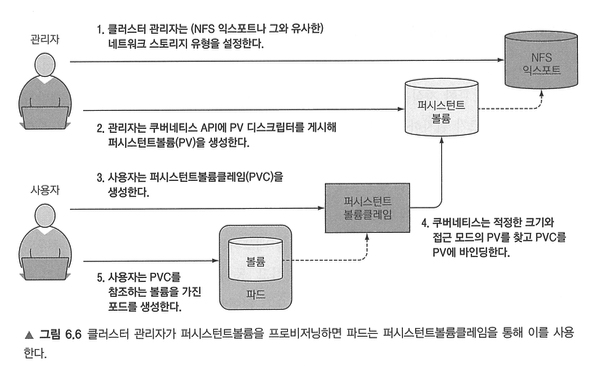
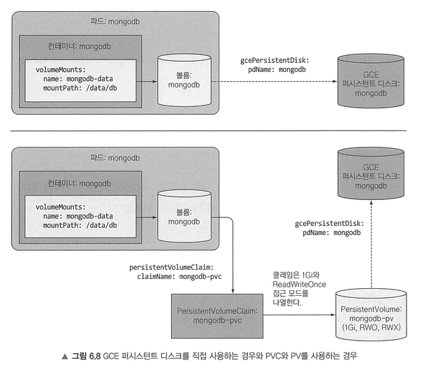
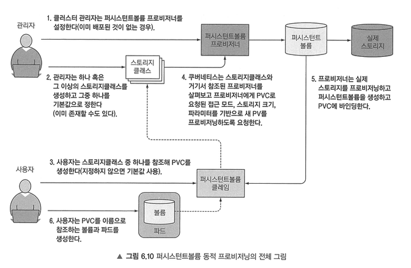

# 6. 볼륨: 컨테이너에 디스크 스토리지 연결

파드는 내부에 프로세스가 실행되고 CPU, RAM, 네트워크 인터페이스 등의 리소스를 공유하는 논리적 호스트와 유사하다.  
파드 내부의 각 컨테이너는 고유하게 분리된 파일시스템을 가진다. 파일시스템은 컨테이너 이미지에서 제공되기 때문이다.  
새로 시작한 컨테이너는 이전에 실행했던 컨테이너에 쓰여진 파일시스템의 어떤 것도 다시 볼 수 없다. 이를 위해 볼륨을 사용한다.  
스토리지 볼륨은 파드의 일부분으로 정의되며 파드와 동일한 라이프사이클을 가진다. 따라서 컨테이너를 다시 시작해도 볼륨의 콘텐츠는 지속된다.  
컨테이너가 다시 시작되면 새로운 컨테이너는 이전 컨테이너가 볼륨에 기록한 모든 파일들을 볼 수 있고, 파드가 여러 개의 컨테이너를 가진 경우 모든 컨테이너가 볼륨을 공유할 수 있다.

 

## 6.1 볼륨 소개

볼륨은 파드의 구성 요소로 파드 스펙에서 정의된다. 볼륨은 독립적인 쿠버네티스 오브젝트가 아니므로 자체적으로 생성, 삭제될 수 없다.  
볼륨은 파드의 모든 컨테이너에서 사용 가능하지만 접근하려는 컨테이너에서 각각 마운트돼야 한다. 각 컨테이너에서 파일시스템의 어느 경로에나 볼륨을 마운트할 수 있다.  
리눅스에서는 파일시스템을 파일 트리의 임의 경로에 마운트할 수 있다. 이렇게 하면 마운트된 파일시스템의 내용은 마운트된 디렉터리에서 접근 가능하다.  
같은 볼륨을 두 개의 컨테이너에 마운트하면 컨테이너는 동일한 파일로 동작할 수 있다.  
컨테이너와 볼륨이 같은 파드에서 구성됐더라도 컨테이너는 그 파일에 접근할 수 없다. 컨테이너에서 접근하려면 파드에서 볼륨을 정의하는 것만으로는 충분하지 않고 `VolumeMount`를 컨테이너 스펙에 정의해야 한다.  

볼륨의 유형은 다음과 같다:
- emptyDir: 빈 디렉터리
- hostPath: 워커 노드의 파일시스템을 파드의 디렉터리로 마운트
- gitRepo: git repository의 콘텐츠를 체크아웃해 초기화
- nfs: NFS 공유를 파드에 마운트
- gcePersistentDisk... : 클라우드 제공자의 전용 스토리지 마운트
- cinder, cephfs, iscsi... : 다른 유형의 네트워크 스토리지 마운트
- configMap, secret, downwardAPI: k8s 리소스나 클러스터 정보를 파드에 노출하는 데 사용되는 볼륨
- persistentVolumeClaim: 사전에 혹은 동적으로 프로비저닝된 persistent storage

 

## 6.2 볼륨을 사용한 컨테이너 간 데이터 공유

`emptyDir` 볼륨은 동일 파드에서 실행 중인 컨테이너 간 파일을 공유할 때 유용하다.  
컨테이너 두 개와 각 컨테이너에 각기 다른 경로로 마운트된 단일 볼륨이 있을 때, 각 컨테이너는 다른 컨테이너가 작성한 파일을 확인 후 서비스할 수 있다.  
볼륨으로 사용한 `emptyDir`은 파드를 호스팅하는 워커 노드의 실제 디스크에 생성되므로 노드 디스크가 어떤 유형인지에 따라 성능이 결정된다. 쿠버네티스에 `emptyDir`을 디스크가 아닌 메모리를 사용하는 tmpfs 파일시스템으로 생성하도록 요청할 수 있다.  

`gitRepo` 볼륨은 기본적으로 `emptyDir` 볼륨이며 파드가 시작되면 컨테이너가 생성되기 전에 깃 레포를 복제하고 특정 리비전을 체크아웃해 데이터로 채운다. 이러면 파드의 컨테이너가 마운트 경로에 깃 볼륨이 마운트된 상태에서 시작할 수 있다.  
`gitRepo` 볼륨은 깃 레포와 동기화하지 않기 때문에 변경 사항을 동기화하려면 사이드카 컨테이너로 추가 프로세스를 실행해야 한다.  
**사이드카 컨테이너**는 파드의 주 컨테이너의 동작을 보완하는 컨테이너로, 새로운 로직을 메인 애플리케이션 코드에 넣어 복잡성은 낮추고 재사용성을 떨어뜨리는 대신 파드에 사이드카를 추가하면 기존 컨테이너 이미지를 사용할 수 있다.  
또한 `gitRepo` 볼륨은 프라이빗 레포 복제가 불가능하기 때문에 깃 동기화 사이드카를 사용해야 한다.  
`gitRepo` 볼륨은 기본적으로 볼륨을 포함하는 파드를 위해 특별히 생성되고 독점적으로 사용되는 전용 디렉터리이므로 파드가 삭제되면 볼륨과 컨텐츠도 삭제된다.  
그러나 다른 유형의 볼륨은 새 디렉터리를 생성하지 않고 기존에 존재하는 외부 디렉터리를 파드의 컨테이너 파일시스템에 마운트하기 때문에 볼륨의 컨텐츠는 파드 인스턴스 여러 개에서 살아남을 수 있다.

 

## 6.3 워커 노드 파일시스템의 파일 접근

특정 시스템 레벨의 파드는 노드의 파일을 읽거나 노드 디바이스를 접근하기 위해 노드의 파일시스템을 사용해야 하는데, kubernetes는 `hostPath` 볼륨으로 가능케 한다.  
`hostPath` 볼륨은 노드 파일시스템의 특정 파일이나 디렉터리를 가리킨다. 동일 노드에 실행 중인 파드가 `hostPath` 볼륨의 동일 경로를 사용 중이면 동일한 파일이 표시된다.
`hostPath` 볼륨의 컨텐츠는 파드가 삭제되어도 남아 있다. 파드가 삭제되면 다음 파드가 호스트의 동일 경로를 가리키는 `hostPath` 볼륨을 사용하고, 이전 파드와 동일한 노드에 스케줄링되는 조건으로 새로운 파드는 이전 파드가 남긴 모든 항목을 볼 수 있다.  
볼륨의 컨텐츠는 특정 노드의 파일시스템에 저장되므로 해당 파드가 다른 노드로 다시 스케줄링되면 더 이상 이전 데이터를 볼 수 없어 데이터베이스의 데이터 디렉터리로 사용하기에는 적합하지 않다.  

 

## 6.4 퍼시스턴트 스토리지 사용

파드에서 실행 중인 애플리케이션이 디스크에 데이터를 유지해야 하고 파드가 다른 노드로 재스케줄링된 경우에도 동일한 데이터를 사용해야 한다면 NAT(Network-Attached Storage) 유형에 저장되어야 한다.  
쿠버네티스 클러스터가 있는 동일한 영역에 GCE persistent disk를 생성하고, 해당 GCE persistent disk를 참조하는 볼륨을 마운트하는 컨테이너는 퍼시스턴트 스토리지를 사용할 수 있다.  
AWS에서는 EBS(ElasticBlockStore), Azure는 azureDisk 볼륨을 사용할 수 있다.  

클러스터가 여러 대의 서버로 실행되는 경우 외장 스토리지를 볼륨에 마운트하기 위한 다양한 지원 옵션이 제공된다.  
예를 들어 NFS 공유를 마운트하기 위해서는 NFS 서버와 서버에스 익스포트 경로를 지정하면 된다.  
지원되는 다른 옵션으로는 ISCSI 디스크 리소스를 마운트하기 위한 iscsi, GlusterFS 마운트를 위한 glusterfs 등이 있다.  
하지만 이렇게 파드의 볼륨이 실제 기반 인프라스트럭처를 참조하는 것은 쿠버네티스가 추구하는 바가 아니다. 인프라 관련 정보를 파드 정의에 포함된다는 것은 파드 정의가 특정 쿠버네티스 클러스터에 밀접하게 연결되므로 동일한 파드 정의를 다른 클러스터에서는 사용할 수 없기 때문이다.

 

## 6.5 기반 스토리지 기술과 파드 분리

이상적으로는 쿠버네티스에 애플리케이션을 배포하는 개발자는 기저에 어떤 종류의 스토리지 기술이 사용되는지 알 필요가 없어야 하고, 동일한 방식으로 파드를 실행하기 위해 어떤 유형의 물리 서버가 사용되는지 알 필요가 없어야 한다. 인프라 관련 처리는 클러스터 관리자만의 영역이어야 한다.  
개발자가 애플리케이션을 위해 일정량의 퍼시스턴트 스토리지를 필요로 하면 쿠버네티스에 요청할 수 있어야 하고, 동일한 방식으로 파드 생성 시 CPU, 메모리와 다른 시소르르 요청할 수 있어야 한다. 시스템 관리자는 클러스터를 구성해 애플리케이션이 요구한 것을 제공할 수 있어야 한다.  

 
인프라의 세부 사항을 처리하지 않고 애플리케이션이 쿠버네티스 클러스터에 스토리지를 요청할 수 있도록 하기 위해 PV(PersistentVolume)과 PVC(PersistentVoluymeClaim)이 도입됐다.  
개발자가 파드에 기술적인 세부 사항을 기재한 볼륨을 추가하는 대신 클러스터 관리자가 기반 스토리지를 설정하고 쿠버네티스 API 서버로 PV 리소스를 생성해 쿠버네티스에 등록한다. PV가 생성되면 관리자는 크기와 지원 가능한 접근 모드를 지정한다.  
클러스터 사용자가 파드에 Persistent Storage를 사용해야 하면 최소 크기와 필요한 접근 모드를 명시한 PVC manifest를 생성한다.  
그 후 사용자가 PVC manifest를 k8s API 서버에 게시하고 k8s는 적절한 PVf를 찾아 클레임에 볼륨을 바인딩한다. 
그 뒤 PVC는 파드 내부의 볼륨 중 하나로 사용될 수 있으며 PVC의 바인딩을 삭제해 릴리스될 때까지 다른 사용자는 동일한 PV를 사용할 수 없다.  

 
PVC와 PV를 사용하게 되면 생성을 위한 추가 절차가 필요하지만, 개발자는 기저에 사용된 실제 스토리지 기술을 알 필요가 없다.  
게다가 동일한 파드와 클레임 매니페스트는 인프라와 관련된 어떤 것도 참조하지 않으므로 다른 쿠버네티스 클러스터에서도 사용할 수 있다.  
클러스터 관리자가 볼륨을 비우지 않았다면 동일한 PV를 사용하는 새 파드는 다른 네임스페이스에서 클레임과 파드가 생성됐다고 할지라도 이전 파드가 저장한 데이터를 읽을 수 있다. (PVC의 Policy를 `Retain`으로 설정한 경우)  
또한 PVC와 파드를 삭제하고 볼륨을 비우지 않으면 이미 볼륨 내부에 데이터가 있기 때문에 새로운 클레임에 바인딩할 수 없다.  
그 외 `Recycle`은 볼륨의 콘텐츠를 삭제하고 볼륨이 다시 클레임될 수 있도록 하는 리클레임 정책이고, `Delete` 정책은 기반 스토리지를 삭제하는 정책이다. (Recycle은 더 이상 사용 X)  

 

## 6.6 퍼시스턴트볼륨의 동적 프로비저닝

클러스터 관리자는 PV 동적 프로비저닝을 통해 실제 스토리지를 미리 프로비저닝할 수 있다.  
클러스터 관리자가 PV를 생성하는 대신 PV provisioner를 배포하고 사용자가 선택 가능한 PV의 타입을 하나 이상 StorageClass 오브젝트로 정의할 수 있다. 사용자가 PVC에서 StorageClass를 참조하면 provisioner가 persisteent storage를 프로비저닝할 때 이를 처리한다.  
사용자가 PVC를 생성하면 결과적으로 새로운 PV가 프로비저닝되므로 관리자는 하나 혹은 그 이상의 StorageClass 리소스를 생성해야 한다.  
StorageClass 리소스는 PVC가 StorageClass에 요청할 때 어떤 provisioner가 PV를 프로비저닝하는데 사용돼야 할지를 지정한다.  

 
스토리지 클래스에 정의된 파라미터들은 프로비저너에 전달되며, 파라미터는 각 프로비저너 플러그인마다 다르다.  
스토리지 클래스의 좋은 점은 클레임 이름으로 이를 참조한다는 것이다. 다른 클러스터 간 스토리지 클래스 이름을 동일하게 사용한다면 PVC 정의를 다른 클러스터로 이식 가능하다.  
기본 스토리지 클래스는 PVC에서 명시적으로 어떤 스토리지 클래스를 사용할지 지정하지 않은 경우 PV를 동적 프로비저닝하는 데 사용된다.  
StorageClassName 속성을 빈 문자열로 지정하지 않으면 미리 프로비저닝된 PV가 있더라도 동적 볼륨 프로비저너는 새로운 PV를 프로비저닝한다.  

