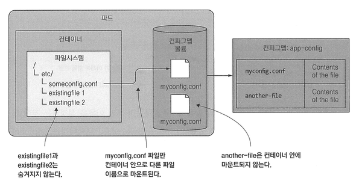
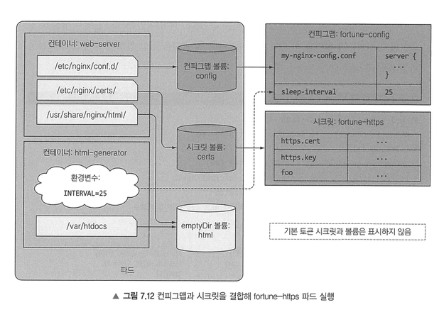

# 7. 컨피그맵과 시크릿: 애플리케이션 설정

## 7.1 컨테이너화된 애플리케이션 설정

컨테이너화된 애플리케이션에서 설정을 애플리케이션에 전달할 때 사용하는 방법은 명령줄 인수와 환경 변수 주입이 있다.  
도커 컨테이너 내부에 있는 설정 파일을 사용하려면 컨테이너 이미지 안에 포함하거나 파일이 포함되어 있는 볼륨을 컨테이너에 마운트해야 하므로 설정 파일을 사용하는 것은 까다롭다.  
또한 설정 파일을 이미지 안에 넣고 빌드하면 설정 파일의 정보를 이미지에 접근할 수 있는 모든 사람이 확인할 수 있다.  
따라서 설정 데이터를 최상위 레벨의 쿠버네티스 리소스에 저장하고 이를 깃 저장소 혹은 다른 파일 기반 스토리지에 저장할 수 있다.  
설정 데이터를 저장하는 쿠버네티스 리소스를 ConfigMap이라고 한다.  

ConfigMap으ㄹ 사용해 다음 방법을 통해 애플리케이션을 구성할 수 있다.  
- 컨테이너에 명령줄 인수 전달
- 각 컨테이너를 위한 사용자 정의 환경변수 지정
- 특수항 유형의 볼륨을 통해 설정 파일을 컨테이너에 마운트

 

## 7.2 컨테이너에 명령줄 인자 전달

컨테이너에서 실행하는 전체 명령은 명령어와 인자 두 부분으로 구성되어 있다.
- `ENTRYPOINT`: 컨테이너 안에서 실행되는 실행파일
- `CMD`: 실행파일에 전달되는 인자

ENRTYPOINT 명령어로 실행하고 기본 인자를 정의하려는 경우에만 CMD를 지정하는 것이 올바른 방법이다.  
해당 값은 컨테이너 정의 안에 `command`와 `args` 속성을 지정하여 재정의할 수 있다.  

실행 명령어에는 다음 두 가지가 있다:
- shell 형식: `ENTRYPOINT node app.js`, 내부에서 정의된 명령을 셸로 호출
- exec 형식: `ENTRYPOINT ["node", "app.js"]`, 컨테이너 내부에서 프로세스를 직접 실행

 

## 7.3 컨테이너의 환경변수 설정

파드를 만들 때 환경변수를 컨테이너 정의에 포함해 스크립트에 전달할 수 있다.  
`$(VAR)` 구문을 사용해 의미 정의된 환경변수나 기타 기존 변수를 참조할 수도 있다.  
하지만 하드코딩된 값을 가져올 경우 프로덕션과 개발 환경에서 서로 분리된 파드 정의를 사용하지 못한다. 여러 환경에서 동일한 파드 정의를 재사용하려면 파드 정의에서 설정을 분리하는 것이 좋다.
이 경우 `ConfigMap Resource`를 사용해 `valueFrom`으로 환경변수 값의 원본 소스를 받아올 수 있다.  

 

## 7.4 컨피그맵으로 설정 분리

애플리케이션 구성의 요점은 환경에 따라 다르거나 자주 변경되는 설정 옵션을 애플리케이션 소스 코드와 별도로 유지하는 것이다.  
k8s에서는 설정 옵션을 ConfigMap이라고 부르는 별도 오브젝트로 분리할 수 있다. ConfigMap은 짧은 문자열에서 전체 설정 파일에 이르는 값을 가지는 키/값 쌍으로 구성된 맵이다.  
ConfigMap의 내용은 컨테이너의 환경변수 또는 볼륨 파일로 전달된다. 환경변수는 `$(ENV_VAR)` 구문을 사용해 명령줄 인수에서 참조할 수 있기 때문에 ConfigMap 항목을 프로세스의 명령줄 인자로 전달할 수도 있다.  
애플리케이션은 쿠버네티스 REST API 엔드포인트를 통해 ConfigMap의 내용을 직접 읽을 수 있지만, 반드시 필요한 경우가 아니면 애플리케이션은 쿠버네티스와 무관하도록 유지하는 것이 좋다.  
ConfigMap을 별도의 독립적인 오브젝트에 설정은 포함하면 각각 다른 환경에 관해 동일한 이름으로 ConfigMap에 관한 여러 Manifest를 유지할 수 있다.  
파드는 ConfigMap을 이름으로 참조하기 때문에 모든 환경에서 동일한 파드 정의를 사용해 각 환경에서 서로 다른 설정을 사용할 수 있다.  

ConfigMap은 문자열, 전체 설정 파일과 같은 데이터를 저장하는 것도 가능하다. 디렉터리에서 여러 개의 파일을 가져오는 것도 가능하다.  
이렇게 가져온 값은 `valudFrom`으로 환경변수를 전달하거나, `envFrom`, `configMapRef`로 configMap의 모든 환경변수를 특정 prefix를 붙여 가져올 수 있다.  
ConfigMap은 키가 올바른 형식이 아닌 경우 해당 항목을 건너뛴다.
이렇게 가져온 ConfigMap의 값은 환경변수에 `$(ENVVARUABLENAME)` 문법을 사용해 쿠버네티스가 해당 변수의 값을 인자에 주입한다.  

 
컨피그맵을 컨테이너에 연결하면 설정값이 파일로 만들어진다. 프로그램은 이 파일을 읽어 설정값을 사용한다.  
컨피그맵의 항목을 개별 파일로 기존 디렉터리 안에 있는 모든 파일을 숨기지 않고 추가하려면 `volumeMount`에 subPath 속성으로 파일이나 디렉터리 하나를 볼룸에 마운트한다.  
subPath 속성으로 불러오면 일부만을 마운트할 수 있다. 하지만 개별 파일을 마운트하는 방법은 파일 업데이트와 관련해 상대적으로 큰 결함을 갖고 있다.  
기본적으로 컨피그맵 볼륨의 모든 파일 권한은 644로 설정되고, 볼륨 정의 안에 있는 defaultMode 속성을 설정해 변경 가능하다.

환경변수 또는 명령줄 인수를 설정 소스로 사용하면 프로세스가 실행되고 있는 동안 값을 업데이트 할 수 없다는 단점이 있다.  
컨피그맵을 사용해 볼륨으로 노출하면 파드를 다시 만들거나 컨테이너를 다시 시작할 필요 없이 설정을 업데이트할 수 있다.  
컨피그맵을 업데이트하면 이를 참고하는 모든 볼륨의 파일이 업데이트되고, 업데이트가 감지되면 프로세스가 값을 다시 로드한다.  
쿠버네티스는 심볼릭 링크를 사용해 컨피그맵 볼륨에 있는 모든 파일을 불러오도록 마운트된다. 따라서 모든 파일이 한 번에 동시에 업데이트된다.  
만약 전체 볼륨 대신 단일 파일을 컨테이너의 마운트한 경우(= subPath) 파일이 업데이트되지 않는다. 이 경우 전체 볼륨을 다른 디렉터리에 마운트한 다음 해당 파일을 가리키는 심볼릭 링크를 생성해야 한다.  
컨피그맵 볼륨의 파일이 실행 중인 모든 인스턴스에 걸쳐 동기적으로 업데이트되지 않기 때문에, 개별 파드의 파일이 최대 1분 동안 동기화되지 않은 상태로 있을 수 있다.

 

## 7.5 시크릿으로 민감한 데이터를 컨테이너에 전달

자격 증명이나 개인 암호화 키와 같은 민감한 정보를 보관하고 배포하기 위해 시크릿이라는 키-값 쌍을 가진 맵을 제공한다.  
쿠버네티스는 시크릿에 접근해야 하는 파드가 실행되고 있는 노드에만 개별 시크릿을 배포해 시크릿을 안전하게 유지한다.  
또한 노드 자체적으로 시크릿을 항상 메모리에만 저자오디게 하고 물리 저장소에 기록되지 않도록 한다. 물리 저장소는 시크릿을 삭제한 후에도 디스크를 완전히 삭제하는 작업이 필요하기 때문이다.
마스터 노드(etcd)에는 시크릿을 암호화되지 않은 형식으로 저장하므로 시크릿에 저장한 민감한 데이터를 보호하려면 마스터 노드를 보호하는 것이 필요하다. (1.7부터는 암호화된 형태로 저장한다.)  
민감하지 않고 일반 설정 데이터는 ConfigMap을, 민감한 데이터는 Secret을 사용해 키 아래에 보관하는 것이 필요하다.  

  
시크릿이 갖고 있는 세 가지 항목(ca.crt, namespace, token)은 파드 안에서 쿠버네티스 API 서버와 통신할 때 필요한 것들이다.  
시크릿은 secret 볼륨이 마운트된 디렉터리에서 파일을 확인할 수 있다.  
시크릿 항목의 내용은 Base64 인코딩 문자열로 표시되고, 컨피그맵의 내용은 일반 텍스트로 표시된다. 쓰기 전용인 stringData 필드로 설정하면 data 항목 아래에 Base64로 인코딩돼 표시된다.  
시크릿은 인메모리 파일시스템(tmpfs)를 사용해 디스크에 값을 저장하지 않는다.  
시크릿을 환경변수로 노출하고자 할 때는 `secretKeyRef`를 사용해 시크릿을 참조할 수 있다. 하지만 시크릿을 노출하는 것은 좋은 방법은 아니다.  

파드를 배포할 때 컨테이너 이미지가 private resigtry 안에 있다면, 쿠버네티스는 이미지를 가져오기 위해 필요한 자격증명을 알아야 한다.  
프라이빗 저장소를 사용하는 파드를 실행하려면 해당 레지스트리 자격증명을 가진 시크릿을 생성하고, 파드 매니페스트 안에 `imagePullSecrets` 필드에 해당 시크릿을 참조하도록 해야 한다.  
이렇게 직접 시크릿을 참조하는 것보다는 이미지를 가져올 때 사용할 시크릿을 ServiceAccount에 추가해 모든 파드에 자동으로 추가될 수 있게 하는 것이 권장된다.  