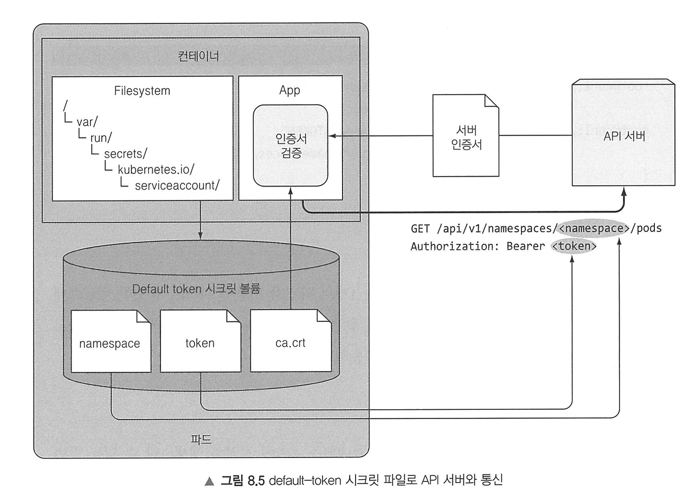
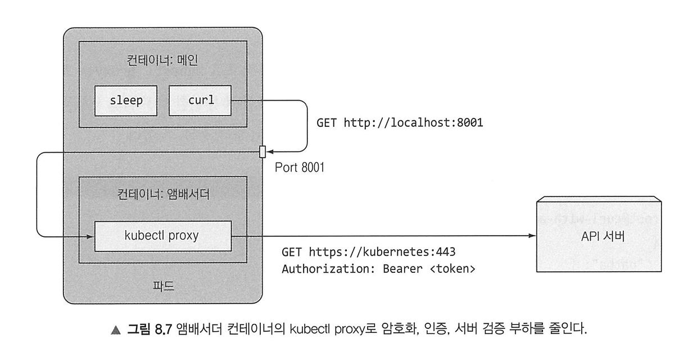

# 8. 애플리케이션에서 파드 메타데이터와 그 외의 리소스에 액세스하기

## 8.1 Downward API로 메타데이터 전달

사용자가 데이터를 직접 설정하거나 파드가 노드에 스케줄링돼 실행되기 이전에 이미 알고 있던 데이터는 ConfigMap 혹은 Secret Volumn으로 전달하기 적합하다.  
그러나 파드의 IP, 호스트 노드 이름과 같이 실행 시점까지 알려지지 않은 데이터의 경우 동일한 정보를 여러 곳에 반복해서 설정하는 것은 비효율적이다.  
이는 환경변수 또는 파일로 파드와 해당 환경의 메타데이터를 전달하는 **Downward API**를 통해 해결할 수 있다.
Downward API를 사용하면 파드 자체의 메타데이터(이름, IP 주소, 네임스페이스, 노드, CPU와 메모리 요청 등)를 컨테이너에 전달 가능하다.  

환경변수 대신 파일로 메타데이터를 노출하는 경우 downwardAPI 볼륨을 정의해 컨테이너에 마운트할 수 있다.  
환경변수로 파드의 레이블이나 어노테이션을 노출할 수 없기 때문에 downwardAPI 볼륨을 사용해야 한다.  
환경변수로 메타데이터를 전달하는 대신 downward라는 볼륨을 정의하고 컨테이너의 `/etc/downward` 아래에 마운트한다. 이 볼륨에 포함된 파일들은 볼륨 스펙의 downwardAPI.items 속성 아래에 설정된다.  
각 항목은 메타데이터를 기록할 경로(파일 이름)와 파일에 저장할 파드 수준의 필드나 컨테이너 리소스 필드에 대한 참조를 지원한다.  
레이블과 어노테이션은 파드가 실행되는 동안 수정할 수 있다. 환경변수의 값은 나중에 업데이트할 수 없기 때문에 파드의 레이블 또는 어노테이션이 환경변수로 노출된 경우 변경이 발생한 다음에 새로운 값을 노출할 수 있는 방법이 없어 두 항목은 볼륨을 사용하여 노출한다.  
볼륨 스펙 내에서 컨테이너의 리소스 필드를 참조할 때는 참조하는 컨테이너의 이름을 명시적으로 지정해야 한다.  

 

## 8.2 쿠버네티스 API 서버와 통신하기

Downward API는 파드 자체의 메타데이터와 모든 파드의 데이터 중 일부만 노출한다. 그리고 서비스와 파드에 관한 정보는 서비스 관련 환경변수나 DNS로 얻을 수 있다.  
애플리케이션이 다른 리소스의 정보가 필요하거나 가능한 한 최신 정보에 접근해야 하는 경우 API 서버와 직접 통신해야 한다.  

쿠버네티스 API와 직접 통신하려면 `kubectl cluster-info`를 실행해 URL을 확인한 뒤 `curl <URL>`을 하면 된다고 생각할 수 있지만, 서버 인증 때문에 불가능하다.  
이 경우 `kubectl proxy` 명령으로 프록시 서버를 실행해 로컬 컴퓨터에서 HTTPS를 API 서버로 전달하고, 요청 시마다 인증을 관리해 접속할 수 있다.  
서버에 접속하면 쿠버네티스를 이루는 REST 엔드포인트들을 확인할 수 있다.  

그렇다면 kubectl이 없는 파드에서 통신하려면 어떻게 해야 할까? 파드 내부에서 API 서버와 통신하려면 다음 세 가지를 처리해야 한다.
- API 서버의 위치
- API 서버임을 인증 (위변조 방지)
- API 서버로 인증

API 서버와 통신할 파드의 경우, 새 파드를 실행한 뒤 Docker Hub에서 tutum/curl 이미지를 가져온 뒤 컨테이너 내부에서 bash 셸을 실행하면 된다.  
이후 k8s API 서버의 AIP와 포트를 찾아야 하는데, kubernetes라는 서비스가 default namespace에 자동으로 노출되고, 이 서비스가 API 서버를 가리키도록 구성되어 있다.  
따라서 컨테이너 내부의 환경변수에서 API 서버의 IP 주소와 포트를 얻을 수 있다.  

시크릿에는 세 개의 항목이 있는데, 그 중에서 쿠버네티스 API 서버의 인증서에 서명하는 데 사용되는 인증 기관(CA)의 인증서는 ca.crt 파일에 작성되어 있다.  
서버의 인증서를 신뢰할 수 있는 CA가 서명하면 서버의 ID를 확인 가능하다.  

서버에서 인증을 통과해야 클러스터에 배포된 API 오브젝트를 읽고, 업데이트와 삭제를 할 수 있다.  
인증하려면 인증 토큰이 필요한데, 이 토큰은 시크릿 볼륨의 token 파일에 저장된다.  
해당 토큰을 요청의 Authorization HTTP 헤더 내부에 전달하면 API 서버는 토큰을 인증된 것으로 인식하고 적절한 응답을 반환한다.  
역할 기반 액세스 제어(RBAC)가 활성화된 경우 서비스 어카운트가 API 서버에 액세스할 권한이 없을 수 있다.

 
파드 내에서 실행 중인 애플리케이션이 쿠버네티스 API에 적절히 액세스할 수 있는 방법은 다음과 같다:
- 애플리케이션은 API 서버의 인증서가 인증 기관으로부터 서명됐는지를 검증해야 하며, 인증 기관의 인증서는 ca.cart 파일에 있다.
- 애플리케이션은 token 파일의 내용을 Authorization HTTP 헤더에 Bearer 토큰으로 넣어 전송해서 자신을 인증해야 한다.
- namespace 파일은 파드의 네임스페이스 안에 있는 API 오브젝트의 CRUD 작업을 수행할 때 네임스페이스를 API 서버로 전달하는 데 사용해야 한다.

 

 
API 서버를 쿼리해야 하는 애플리케이션이 API 서버와 직접 통신하는 대신 메인 컨테이너 옆의 **엠베서더 컨테이너**에서 kubectl proxy를 실행하고 이를 통해 API 서버와 통신할 수 있다.  
API 서버와 직접 통신하는 대신 메인 컨테이너의 애플리케이션은 HTTPS 대신 HTTP로 앰배서더에 연결하고 앰배서더 프록시가 API 서버에 대한 HTTPS 연결을 처리하도록 해 보안을 투명하게 관리할 수 있다.  
파드의 모든 컨테이너는 동일한 루프백 네트워크 인터페이스를 공유하므로 애플리케이션은 localhost의 포트로 프록시에 액세스할 수 있다.  
해당 방식은 HTTP 요청을 앰배서더 컨테이너 내에서 실행 중인 프록시로 전송한 다음, 프록시는 HTTPS 요청을 API 서버로 전송하며, 토큰을 전송해 클라이언트 인증을 처리하고 서버의 인증서를 검증해 서버의 신원을 확인한다.  
이를 통해 외부 서비스에 연결하는 복잡성을 숨기고 메인 컨테이너에서 실행되는 애플리케이션을 단순화할 수 있다.  
앰배서더 컨테이너는 메인 애플리케이션의 언어에 관계없이 여러 애플리케이션에서 재사용할 수 있으나, 추가 프로세스가 실행 중이고 추가 리소스를 소비한다는 단점이 있다.  

단순한 API 요청 이상을 수행하려면 쿠버네티스 API 클라이언트 라이브러리 중 하나를 사용하는 것이 좋다.  
공식적으로는 golang, python 클라이언트가 있으며 그 외에도 Java, Node.js, PHP 등 다양한 언어의 사용자 제공 클라이언트 라이브러리가 있다.  
이러한 라이브러리는 일반적으로 HTTPS를 지원하고 인증을 관리하므로 앰배서더 컨테이너를 사용할 필요가 없다.  