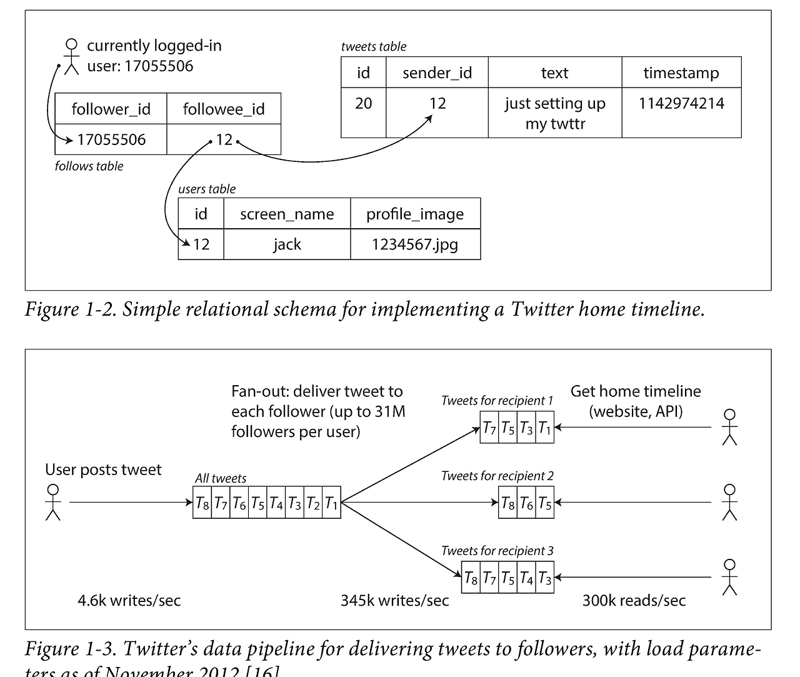

# 1. 신뢰할 수 있고 확장 가능하며 유지보수하기 쉬운 애플리케이션

데이터 중심 애플리케이션에서 처리해야 하는 문제는 데이터의 양, 데이터의 복잡도, 데이터의 변화 속도에 관한 것이다. 
최근 애플리케이션은 데이터베이스(MySQL, Oracle), 캐시(Redis, Memcached), 검색 색인(ElasticSearch), 스트림 처리(Apache Kafka), 일괄 처리 (Hadoop)와 같은 시스템을 요구한다.

일반적으로 데이터베이스, 큐, 캐시 등을 데이터 시스템이라는 포괄적 용어로 묶어야 하는 이유는 다음과 같다:
1. 데이터 저장과 처리에 대한 여러 도구는 최근에 만들어졌기 때문에 쓰임새에 따른 전통적인 분류에 맞지 않는다. (= 분류 간의 경계가 흐려지고 있다.)
2. 작업을 단일 도구에서 효율적으로 수행할 수 있는 테스크로 나눠 다양한 도구들을 코드로 연결하는 방식을 많이 사용한다.

 

소프트웨어 시스템에서 중요하게 생각하는 관심사는 다음과 같다:
- 신뢰성: 문제가 발생하더라도 시스템은 지속적으로 올바르게 동작해야 한다.
- 확장성: 시스템의 데이터 양, 트래픽 양, 복잡도가 증가하면 이를 처리할 수 있는 적절한 방법이 있어야 한다.
- 유지보수성: 모든 사용자가 시스템 상에서 생산적으로 작업할 수 있게 해야 하낟.

 

## 신뢰성

신뢰성은 "무언가 잘못되더라도 지속적으로 올바르게 동작하는 것"으로 이해할 수 있다.

잘못될 수 있는 일을 결함이라고 부르고, 결함을 예측하고 대처할 수 있는 시스템을 내결함성 또는 탄력성을 지녔다고 말한다. 
일반적으로 결함은 사양에서 벗어난 시스템의 한 구성 요소로 정의되지만, 장애는 사용자에게 필요한 서비스를 제공하지 못하고 시스템 전체가 멈춘 경우다. 
구체적인 예시를 들자면 1대의 로드 밸런서에 연결된 3대의 인스턴스 중 하나의 인스턴스가 응답이 되지 않는다면 결함이고, 로드 밸런서가 자체가 요청을 처리하지 못해 응답이 되지 않는다면 장애이다. 
결함 확률을 0으로 줄이는 것은 불가능하기 때문에 고의적으로 결함을 유도함(= 카오스 엔지니어링)으로써 내결함성 시스템을 지속적으로 훈련하고 테스트하는 것으로 대처한다.

먼저 하드웨어로 인한 결함이 발생할 수 있다. 
해당 경우 각 하드웨어 구성 요소에 중복을 추가하는 방법이 일반적이다. 중복을 추가하면 구성 요소 하나가 죽으면 고장난 구성 요소가 교체되는 동안 중복된 구성 요소를 대신 사용할 수 있다. 
최근 데이터 양과 애플리케이션의 계산 요구가 늘어나면서 더 많은 수의 장비를 사용하게 됐고, 이에 비례해 하드웨어 결함율도 증가했다. 
또한 일부 클라우드 플랫폼은 가상 장비 인스턴스가 별도의 경고 없이 사용할 수 없게 되는 상황이 일반적이다. (엄청난 동의) 
따라서 소프트웨어 내결함성 기술(health check 후 fail하면 자동 제외, self-healing 등)을 사용하거나 하드웨어 중복성을 추가해 전체 장비의 손실을 견딜 수 있는 시스템으로 옮기고 있다. 이 경우, 전체 시스템의 중단시간 없이 한 번에 한 노드씩 패치(= Rolling Update)할 수 있다는 장점이 있다.

또 다른 부류의 결함으로 시스템 내 체계적 오류가 있다. 
무작위적이고 서로 독립적인 하드웨어 결함과 달리, 소프트웨어 오류는 노드 간 상관관계 때문에 발생하며 시스템 오류를 더욱 많이 유발하는 경향이 있다. 
소프트웨어의 체계적 오류 문제는 테스트, 프로세스 격리, 프로세스 재시작, 시스템 가정 및 상호작용에 대한 분석, 모니터링 등이 문제 해결에 도움이 될 수 있다. 
- 2025-11-18에 발생한 Cloudflare의 장애 원인도 소프트웨어 기반 결함이다. 데이터베이스 권한 변경으로 생성된 Bot Management용 feature 파일이 커졌는데, 파일의 사이즈가 제한을 넘어 소프트웨어에 오류가 발생했다. [리포트](https://blog.cloudflare.com/ko-kr/18-november-2025-outage/)
- 2025-10-20에 발생한 AWS us-east-1 리전 장애 원인도 소프트웨어 기반 결함이다. DynamoDB API 엔드포인트에 대한 DNS 해석이 실패했고, 그 영향을 받은 서비스가 또 다른 서비스에 영향을 주면서 문제가 확대되었다. 이 경우 연쇄 장애에도 해당한다. [농심 NDS Cloud 리포트](https://home.nxavis.com/blog/cloud/outrage), [AWS 서비스 기록](https://health.aws.amazon.com/health/status) 2025-10-20자 us-east-1 확인

 

대규모 인터넷 서비스에 대한 한 연구에 따르면 운영자의 설정 오류가 중단의 주요원인인 반면 하드웨어(서버나 네트워크) 결함은 중단 원인의 10~25% 정도에 그친다. 다음 접근 방식은 인적 오류를 줄일 수 있다.
- 오류의 가능성을 최소화하는 방향으로 시스템을 설계하라
- 사람의 실수로 장애가 발생할 수 있는 부분을 분리하라
- 모든 수준에서 철저하게 테스트하라
- 인적 오류를 빠르고 쉽게 복구할 수 있게 하라
- 모니터링 대책을 마연하라
- 조작 교육과 실습을 시행하라

 

## 확장성

확장성이란 부하가 증가할 때 시스템이 실패하지 않는지를 묻는 것이 아니라, 부하 증가에 대응해 자원을 어떻게 추가하고 구조를 어떻게 변화시킬지를 다루는 설계 문제이다.

확장성을 다루기 위해서는 시스템의 현재 부하를 간결하게 기술해야 한다. 그래야 부하 성장 질문을 논의할 수 있다. 
부하는 **부하 매개변수**로 나타낼 수 있으며 부하 매개변수에는 웹 서버의 초당 요청 수, 데이터베이스의 읽기 대 쓰기 비율, 대화방의 동시 활성 사용자, 캐시 적중률 등이 될 수 있다. 
트위터의 경우 사용자당 팔로워의 분포는 fan-out 부하를 결정하기 때문에 확장성을 논의할 때 핵심 부하 매개변수가 된다.

트위터 확장성 문제 살펴보기

 
트위터의 주요 동작은 트윗 작성과 팔로우한 사람이 작성한 트윗을 보는 홈 타임라인이 있다. 
개별 사용자가 트윗 작성을 하면 많은 팔로워들의 타임라인에 함께 들어가야 하므로 fan-out 논의가 필요하다.

 

 

방법 1: 트윗 작성은 새로운 트윗을 전역 컬렉션에 삽입한다. 홈 타임라인 read를 요청하면 팔로우하는 모든 사람을 찾고, 그 사람들의 모든 트윗을 찾아 시간순 정렬해서 합친다. 이 경우 트윗 작성은 단순하지만 읽기 시점에 비용이 크다.

방법 2: 각 사용자용 홈 타임라인 캐시를 유지한다. 사용자가 트윗을 작성하면 해당 사용자의 팔로워를 찾아서 캐시에 새로운 트윗을 삽입한다. 쓰기 시점에 미리 계산하여 읽기 시점의 계산량을 줄인다. 읽기 요청량에 비해 쓰기 요청량이 적으므로 합리적이지만 트윗 작성 시 많은 부가 작업이 필요하다.

hybrid: 대부분 사용자의 트윗은 홈 타임라인에 넣어주지만(방법 2), 팔로워 수가 매우 많은 사용자는 단일 트윗이 과도한 fan-out 작업을 유발하므로 캐시 삽입 대상에서 제외하고 별도로 가져와 읽는 시점에 사용자의 홈 타임라인에 합친다(방법 1).

시스템 부하를 기술하면 부하가 증가할 때 어떤 일이 일어나는지 조사할 수 있다.  
다음과 같은 두 가지 방식으로 살펴볼 수 있다.
- 부하 매개변수를 증가시켰을 때 시스템 자원을 유지하면 성능은 얼마나 영향을 받을까? (독립변수: 부하 매개변수, 통제변수: 시스템 자원, 종속변수: 성능 지표)
- 부하 매개변수를 증가시켰을 때 성능이 유지되길 원하면 자원을 얼마나 많이 늘려야 할까? (독립변수: 부하 매개변수, 통제변수: 성능 목표, 종속변수: 자원 증가량)

 

일괄 처리 시스템(ex. Hadoop)은 처리량에, 온라인 시스템은 서비스 응답 시간에 관심을 가진다. 
여기서 지연 시간은 요청이 처리되길 기다리는 시간을 말하고, 응답 시간은 요청을 처리하는 실제 시간(처리 시간+지연 시간)을 나타낸다. 
동일한 요청에 대해서 매번 응답 시간이 다르기 때문에 응답 시간은 단일 숫자가 아니라 측정 가능한 값의 분포로 나타낸다.  
이때 여러 원인으로 인해 특이값(outlier)이 생길 수 있다.

평균은 얼마나 많은 사용자가 지연을 경험했는지 나타내지 못하기 때문에 일반적으로 백분위를 살펴본다. 
사용자가 얼마나 오랫동안 기다려야 하는지 알고 싶다면 중앙값(p50), 특이 값이 얼마나 좋지 않은지 살펴보려면 상위 백분위(= 꼬리 지연 시간, p95, p99, p999)를 살펴본다. 
상위 백분위 응답 시간은 서비스의 사용자 경험에 직접 영향을 주기 때문에 서비스 수준 목표(SLO), 서비스 수준 협약서(SLA)에 자주 사용하고 기대 성능과 서비스 가용성을 정의하는 계약서에도 자주 등장한다. 
상위 백분위에서 소수의 느린 요청 처리로 후속 처리가 지체되는 선두 차단 문제가 발생할 수 있으므로 클라이언트 쪽 응답시간 측정이 중요하다. 
부하 테스트에서는 응답 속도에 맞춰 요청을 보내면 안된다. 동기적으로 부하를 생성하면 성능이 나빠질수록 부하가 자동으로 줄어들어 평가를 왜곡할 수 있으므로 미리 정한 부하 수준에 따라 요청을 지속적으로 발생시켜야 한다.

확장성과 관련하여 Scale up(용량 확장, 수직 확장), Scale out(규모 확장, 수평 확장)으로 구분해서 말할 수 있다. 현실적으로 좋은 아키텍처는 실용적인 접근 방식의 조합이 필요하다. 
탄력적인 시스템은 부하 증가를 감지하면 컴퓨팅 자원을 동적으로 추가할 수 있다. 이 경우 부하를 예측할 수 없을 만큼 높은 경우 유용하지만 수동으로 확장하는 시스템이 더 간단하고 운영 상 예상치 못한 일이 적다. 
단일 노드 상태 유지(stateful) 데이터 시스템은 분산 설치 복잡도가 크기 때문에 고가용성 요구가 있을 때까지 단일 노드에 DB를 유지하여 scale up 하는게 통념이다. 
범용적이고 모든 상황에 맞는 만병통치약 같은 확장 아키텍처는 없다. 
아키텍처를 결정하는 요소는 읽기의 양, 쓰기의 양, 저장할 데이터의 양, 데이터의 복잡도, 응답 시간 요구사항, 접근 패턴 등이 있다. 
특정 애플리케이션에 적합한 확장성을 갖춘 아키텍처는 주요 동작이 무엇이고 잘 하지 않는 동작이 무엇인지에 대한 가정으로 구축한다. 이 가정은 곧 부하 매개변수가 된다.

 

## 유지보수성

유지보수에는 버그 수정, 시스템 운영 유지, 장애 조사, 새로운 플랫폼 적용, 새 사용 사례를 위한 변경, 기술 채무 상환, 새로운 기능 추가 등이 있다.
유지보수 중 고통을 최소화하고 레거시 소프트웨어를 직접 만들지 않게끔 소프트웨어를 설계하는 원칙은 다음과 같다.
- 운용성: 운영팀이 시스템을 원활하게 운영할 수 있게 쉽게 만들기
- 단순성: 새로운 엔지니어가 시스템을 이해하기 쉽게 만들기
- 발전성: 엔지니어가 이후에 시스템을 쉽게 변경할 수 있게 하기 = 유연성, 수정 가능성, 적응성

 

좋은 운영성이란 동일하게 반복되는 태스크를 쉽게 수행하도록 해서 운영팀이 더 부가가치 높은 일에 노력을 집중할 수 있게 하는 것이다.
- 좋은 모니터링으로 런타임(runtime) 동작과 시스템의 내부에 대한 가시성 제공
- 표준 도구를 이용해 자동화와 통합을 위한 우수한 지원을 제공
- 개별 장비 의존성을 회피. 유지보수를 위해 장비를 내리더라도 시스템 전체에 영향을 주지 않고 계속해서 운영 가능해야 함
- 좋은 문서와 이해하기 쉬운 운영 모델(예를 들어 “X를 하면 Y가 발생한다”) 제공
- 만족할 만한 기본 동작을 제공하고, 필요할 때 기본값을 다시 정의할 수 있는 자유를 관리자에게 부여
- 적절하게 자기 회복(self-healing)이 가능할 뿐 아니라 필요에 따라 관리자가 시스템 상태를 수동으로 제어할 수 있게 함
- 예측 가능하게 동작하고 예기치 않은 상황을 최소화함

 

복잡도는 상태 공간의 급증, 모듈 간 강한 결합도, 복잡한 의존성, 일관성 없는 명명, 성능 문제 해결을 목표로 한 해킹, 임시방편으로 문제를 해결한 특수 사례 등의 증상으로 나타난다. 
그 중 우발적 복잡도는 소프트웨어가 풀어야 할 문제(= 사용자에게 보이는)에 내재하고 있지 않고 구현에서만 발생하는 것으로 정의했다. 
우발적 복잡도를 제거하기 위한 가장 좋은 도구는 추상화다. 예를 들어, 고수준 프로그래밍 언어를 사용하면 기계어를 직접 사용하지 않아도 되는 것이다.

발전성을 위해 조직 프로세스 측면에서는 애자일 작업 패턴을 도입하거나 테스트 주도 개발(TDD), 리팩토링 등을 도입할 수 있다. 
간단하고 이해하기 쉬운 시스템은 대개 복잡한 시스템보다 수정하기 쉽다.