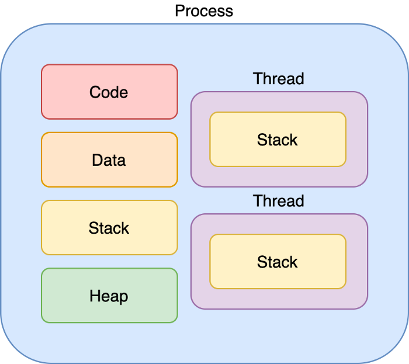
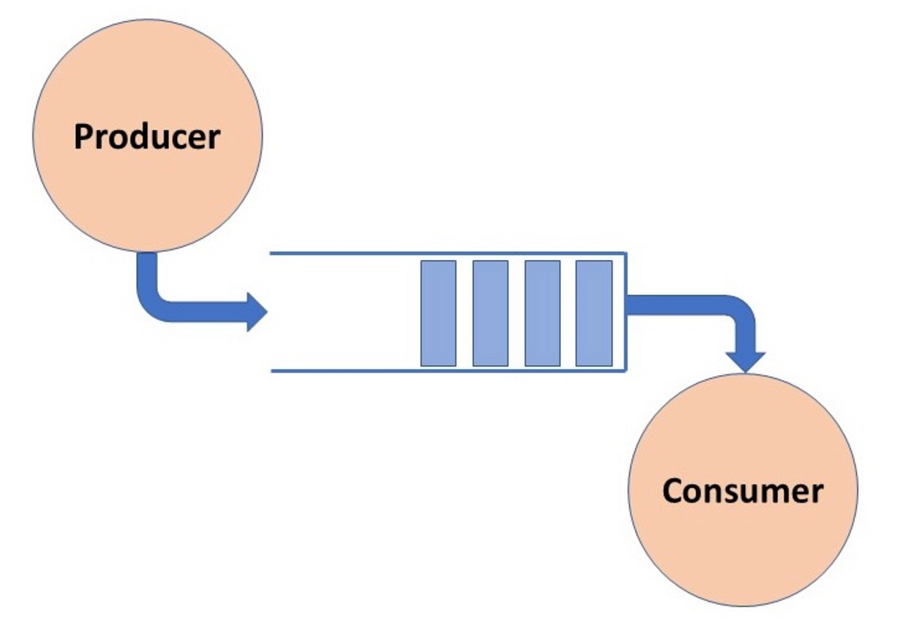

# 2. 프로그램이 실행되었지만, 뭐가 뭔지 하나도 모르겠다.

프로그램의 동적 실행으로 시선을 옮겨 보자.  
→ 프로그램이 실행되면 어떻게 변화하는지? 운영체제는 왜 필요한지? 프로세스, 스레드, 코루틴, 콜백 함수, 동기화, 비동기화, 블로킹, 논블로킹이 무엇인지? 왜 이런 개념들을 이해해야 하는지?

## 2.1 운영 체제, 프로세스, 스레드의 근본 이해하기

CPU는 메모리에서 명령어를 가져와서 실행하는 것만 할 수 있다. 
프로그램 카운터(PC)는 CPU가 다음에 실행할 명령어의 가상 주소를 저장하는 레지스터이며, 일반적으로 현재 명령어의 길이만큼 증가한다. 
분기나 함수 호출과 같은 명령어를 만나면 CPU는 해당 명령어가 지정한 대상 주소에 따라 PC 값을 변경한다.

CPU가 프로그램을 실행하게 하려면 실행 파일을 수동으로 메모리에 복사한 후 main 함수에 해당하는 첫 번째 기계 명령어를 메모리에서 찾아 그 주소를 PC 레지스터에 적재하면 된다. 
이를 위해서는 수동으로 프로그램을 적재할 수 있는 적절한 메모리 영역을 찾고, CPU 레지스터를 초기화하고 함수의 진입 포인트를 찾아 PC 레지스터를 설정하는 작업을 실행해야 한다. 
또한 수동으로 실행하는 프로그램은 한 번에 하나만 실행할 수 있으며, 사용할 하드웨어를 직접 특정 드라이버와 연결해야 외부 장치를 사용할 수 있다. 네트워크로 통신하려면 TCP/IP 스택 소스 코드도 연결해야 한다. 라이브러리도 직접 구현해야 하고, 상호 작용 인터페이스도 구현해야 한다. 
이러한 방식 대신 **적재 도구**를 실행해 프로그램을 메모리에 적재한다.

CPU는 한 시점에 하나의 실행 흐름만 처리할 수 있지만 운영체제가 **프로세스**의 레지스터 상태와 같은 실행 문맥(context)을 저장하고 복구하면서 빠르게 전환함으로써 여러 프로그램이 동시에 실행되는 것처럼 보이게 한다. 
이러한 기능을 포함하여 프로그램 적재, 프로세스 관리, 하드웨어 자원 관리 등의 역할을 수행하는 소프트웨어 집합을 **운영체제**라고 한다.

프로그램이 실행 중일 때 운영 체제의 가상 메모리는 각각의 프로세스가 표준적인 메모리 크기를 독점적으로 사용하는 것처럼 보이게 한다. 이를 프로세스 주소 공간이라고 부른다.
- 코드 영역: 코드를 컴파일하여 생성된 기계 명령어 저장
- 데이터 영역: 전역 변수 등 저장
- 힙 영역: malloc 함수가 요청을 반환한 메모리 할당
- 스택 영역: 함수의 실행 시간 스택

 

독립적인 프로세스를 각각 실행한 후 프로세스 통신을 이용해 다중 프로세스 프로그래밍을 구현하여 실행 속도를 높일 수 있다. 
하지만 프로세스를 생성할 때 오버헤드가 발생하고, 프로세스마다 자체 공간이 있어 프로세스 간 통신을 프로그래밍 하기에 복잡하다는 단점이 있다.

 

 

또한 프로세스는 진입 함수가 `main` 함수 하나밖에 없어 프로세스의 기계 명령어를 한 번에 하나의 CPU에셔만 실행할 수 있다. 
이때 CPU가 여러 개가 있다면, 각 CPU의 PC 레지스터가 `main` 함수가 아닌 다른 함수를 가리키게 하여 새로운 실행 흐름을 형성할 수 있다.  
중요한 점은 실행 흐름이 동일한 프로세스 주소 공간을 공유하므로 프로세스간 통신이 필요하지 않다는 것이다. 
그리고 공유 프로세스 주소 공간에서 동일한 프로세스에 속한 명령어를 동시에 실행할 수 있다.

이렇게 하나의 프로세스 안에 여러 실행 흐름이 존재하는 것을 **스레드**라고 부른다. 
스레드는 코어 개수와는 무관하기 때문에 단일 코어인 상황에서도 스레드 여러 개를 생성할 수 있다. 이 덕분에 처리 시간이 긴 이벤트를 위한 별도의 스레드를 생성하는 방식으로 프로그래밍을 할 수 있다. 
하지만 다중 스레드가 공유 리소스에 접근할 때 상호 배제와 동기화 문제를 해결해야 한다.

함수가 실행될 때 필요한 매개변수, 지역변수, 반환 주소 등의 정보는 스택 프레임에 저장된다. 
스레드를 사용하게 되면서 하나의 프로세스에 실행 진입점과 실행 흐름이 여러 개 존재할 수 있게 되었다. 
이에 따라 프로세스에 주소 공간에 스레드의 실행 흐름을 저장하기 위한 스택 영역이 여러 개 추가되었다.

스레드 활용은 수명 주기 관점에서 볼 때, 긴 작업과 짧은 작업 두 가지 유형이 있다. 
**긴 작업**을 디스크에 데이터를 작성하는 행위 등이 있으며, 이를 처리하기 위해서는 전용 스레드를 생성하는 것이 가장 적합하다. 
**짧은 작업**은 네트워크 요청, 데이터베이스 쿼리 등 처리 시간이 매우 짧은 작업이다. 
짧은 작업은 작업 처리에 필요한 시간이 짧지만, 작업 수가 매우 많기 때문에 요청이 들어올 때마다 해당 작업을 처리하는 요청당 스레드 방식을 사용하면 스레드의 생성과 종료에 시간이 소모되고, 스레드의 독립적인 스택 영역으로 인한 메모리 과다 소비가 발생하고, 스레드 간 전환에 따른 부담이 증가한다.

이를 해결하기 위해 스레드 여러 개를 미리 생성해 두고, 스레드가 처리할 작업이 생기면 해당 스레드에 처리를 요청하는 방법인 **스레드 풀**이 도입되었다. 
이 개념에서 중요한 점은 스레드를 **재사용**하는 것이고, 이를 위해 자료 구조 중 queue를 사용한다.

 

 
스레드 풀에 작업이 전달되는 과정은 다음과 같다. 
1. 스레드 풀의 스레드(처리할 데이터, 데이터 처리 함수)는 작업 대기열에서 블로킹 상태로 대기한다.
2. 생산자가 작업 대기열에 데이터를 기록한다.
3. 스레드 풀의 스레드가 깨어나 작업 대기열에서 처리할 스레드의 데이터를 가져온 후 데이터 처리 함수를 실행한다. 

작업 대기열은 여러 스레드 간에 공유되는 리소스이므로 동기화를 할 때 상호 배제 문제도 처리해야 한다.

스레드 풀의 스레드 수가 너무 적다면 CPU를 최대한 활용할 수 없으며, 너무 많은 스레드를 생성하면 시스템의 성능 저하, 메모리 과다 점유 등의 문제가 발생한다. 
스레드 수를 결정하는 절대 공식은 없으며, 이를 위해서는 구체적인 상황과 그에 대한 분석이 필요하다. 
작업을 처리할 때 필요한 리소스 관점에서 작업을 CPU 집약적인 작업과 입출력 집약적인 작업으로 구분할 수 있다. 
CPU 집약적인 작업은 외부 입출력에 의존할 필요 없이 처리할 수 있는 작업을 의미하며, 스레드 수와 CPU의 코어 수가 동일하다면 CPU의 리소스를 충분히 활용할 수 있다. 
입출력 집약적인 작업은 대부분의 시간을 입출력에 소비하는 작업의 의미한다. 성능 테스트 도구를 사용하여 입출력 대기 시간(WT)와 CPU 연산 시간(CT)를 계산하고, N개의 코어를 가졌다고 할 때 적절한 스레드 수는 `N * (1 + WT / CT)`로 계산할 수 있다.

 

## 2.2 스레드 간 공유되는 프로세스 리소스

